## Learning Objectives

::: incremental
-   Identify common causes of infectious diarrhea in adults in developed
    countries
-   Describe patient history and clinical presentation distinguishing
    viral vs. bacterial causes
-   Recognize warning signs for severe diarrheal disease
-   Describe management approach and treatment
:::

::: notes
This lecture focuses on practical clinical recognition and management of
infectious diarrhea. We'll emphasize the epidemiology, clinical features
that help differentiate pathogens, and evidence-based management. By the
end, you should be able to take a focused history and examination to
guide diagnostic testing and treatment decisions. The content spans from
common outpatient presentations to severe systemic infections like
typhoid fever and hemolytic uremic syndrome.
:::

## Overview — Global Burden

::: incremental
-   Infectious diarrhea: top 10 cause of death worldwide [@Troeger2018]
-   1.7 billion cases annually
-   Leading cause of death in children under 5 years [@Liu2016]
-   In adults in resource-rich settings: often "nuisance disease" with
    key clinical decision points
:::

::: notes
The global burden of diarrheal disease is immense. While mortality in
developed countries is low due to access to rehydration therapy and
antibiotics, infectious diarrhea remains a major health problem
globally. The challenge is identifying which patients need
hospitalization, laboratory testing, or antimicrobial therapy versus
supportive care alone.
:::

## Definitions and Duration {.smaller}

 

::::: columns
::: {.column width="50%"}
**Diarrhea**

-   Passage of loose or watery stools

-   ≥3 times in 24 hours

-   Abnormal stool frequency or consistency
:::

::: {.column width="50%"}
**Duration Categories**

-   Acute: \<14 days

-   Persistent: 14-30 days

-   Chronic: \>30 days
:::
:::::

    **Special Categories** - **Dysentery**: diarrhea with visible
blood, associated with fever and abdominal pain

::: aside
These definitions are important clinically. Acute diarrhea typically has
different etiologies and investigations than chronic diarrhea.
Dysentery—bloody diarrhea—has a more restricted differential diagnosis
and often indicates invasion of the colonic mucosa. Duration influences
your diagnostic approach and threshold for intervention. Most acute
infectious diarrhea we see in clinical practice falls into the acute
category and is self-limited.
:::

## Pathophysiology of Diarrhea {.smaller}

   

::::: columns
::: {.column width="50%"}
**Normal Intestinal Physiology**

-   GI tract absorbs 8-9 L fluid daily

-   Net secretion only 100-200 mL/day

-   Pathogen virulence factors disrupt this balance
:::

::: {.column width="50%"}
**Three Mechanisms of Pathogen Damage**

-   Altered ion absorption/secretion

-   Disruption of epithelial barrier

-   Villus atrophy and enzyme deficiency
:::
:::::

::: aside
Understanding pathophysiology helps predict clinical presentation.
Pathogens that cause secretory toxins lead to watery diarrhea because
they increase intracellular cyclic nucleotides, driving electrolyte
secretion. Pathogens that invade the mucosa cause inflammatory diarrhea
with blood and mucus. The intestine has a remarkable capacity to absorb
fluid, so it takes significant disruption to cause diarrhea. **This also
means that rehydration works because the remaining absorptive capacity
is usually intact in uncomplicated infections.**
:::

## Small bowel vs. large bowel diarrhea {.smaller}

::::: columns
::: {.column width="50%"}
**Small Bowel Pattern**

-   Large volume stools (\>200 mL/stool)

-   Watery consistency

-   Cramping periumbilical pain - 4-8 stools daily

**Associated Symptoms**: Nausea/vomiting common, weight loss possible
:::

::: {.column width="50%"}
**Large Bowel Pattern**

-   Small volume stools (\<200 mL/stool)

-   Frequent passage (\>5-6/day)

-   Painful tenesmus and urgency

-   Bloody or mucoid stools

**Associated Symptoms** - Abdominal cramping/pain -sstemic symptoms less
common
:::
:::::

::: aside
The pattern of diarrhea itself tells you about the location of infection
and helps narrow the differential. Small bowel pathogens like norovirus
or cholera produce large-volume watery stools because they affect water
and electrolyte balance across a larger absorptive surface. Large bowel
pathogens like Shigella cause frequent, small-volume, painful stools
because they invade the mucosa and cause inflammation. Patients can have
both patterns simultaneously.
:::

## Overview of Infectious Etiologies

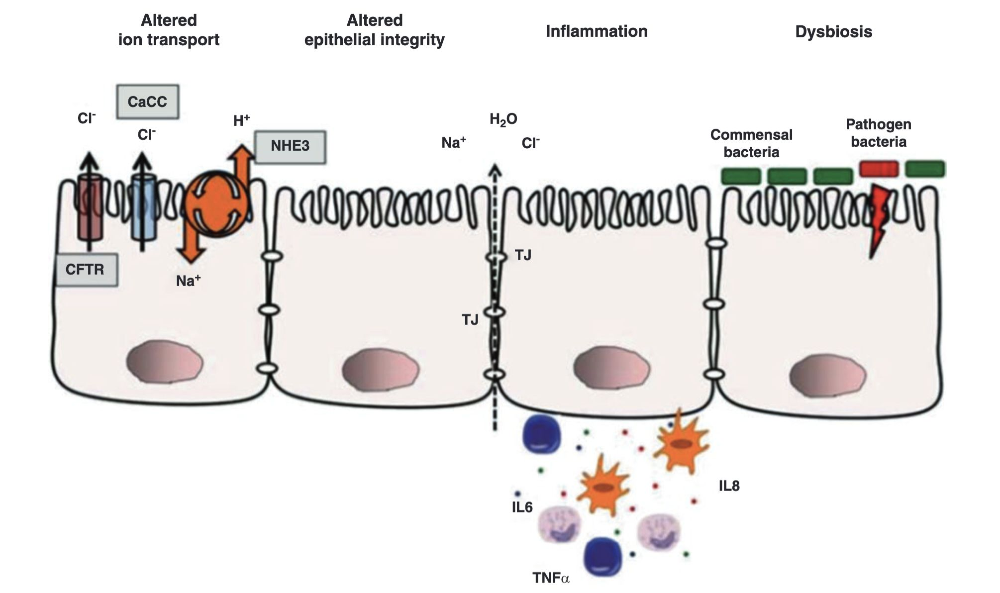{fig-align="center" width="600"}

::: incremental
-   **Most diarrhea is viral**: stool cultures positive only 1.5-5.6%
-   **Viral**: norovirus (most common), rotavirus, adenoviruses 40/41,
    astrovirus
-   **Bacterial**: Salmonella, Campylobacter, Shigella, ETEC, EHEC/STEC
-   **Parasitic**: Cryptosporidium, Giardia, Cyclospora, Entamoeba
:::

::: notes
This epidemiologic insight is crucial: most diarrhea is viral and
self-limited. Stool cultures are positive in less than 6% of cases of
acute diarrhea, which means routine culture for every patient with
diarrhea is wasteful. We should be selective about testing. The major
bacterial pathogens vary by geography and risk factors. In developing
countries, bacterial and parasitic pathogens are more common. In
developed countries, we see more norovirus outbreaks in institutions and
rotavirus in young children. Travelers to developing regions face
different risks than community-acquired diarrhea at home.
:::

## Norovirus — "The Winter Vomiting Virus"

::::: columns
::: {.column width="50%"}
**Key Features**

-   Most common cause of acute gastroenteritis worldwide [@Ahmed2014]

-   Affects all ages, including highly immune populations

-   Mean incubation: 24-48 hours - "Winter vomiting disease" (northern
    hemisphere)
:::

::: {.column width="50%"}
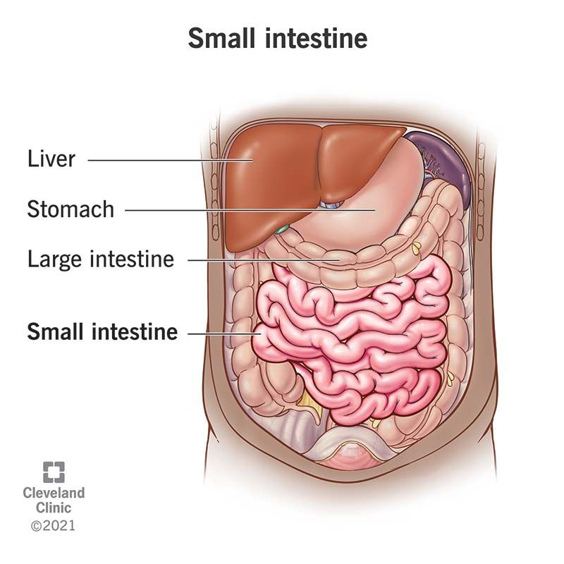{width="350"}
:::
:::::

::: notes
Norovirus is the leading cause of foodborne disease outbreaks in the
United States and Europe. It's notable for its ability to cause
outbreaks in closed environments—schools, cruise ships, hospitals.
Unlike rotavirus, which is primarily a childhood pathogen, norovirus
affects older adults and immunocompetent individuals equally. The
seasonal pattern varies by geography; in temperate climates, it peaks in
winter, but tropical regions show less seasonality. The winter vomiting
virus designation reflects its classic presentation with vomiting as a
prominent feature.
:::

## Norovirus Epidemiology & Transmission

**Viral Characteristics** - Non-enveloped RNA virus, Caliciviridae
family - Multiple genotypes; no lasting immunity after infection
[@Patel2008] - Extremely stable: resists alcohol, chlorine, temperatures
to 60°C

::: incremental
**Transmission Routes** - Primarily fecal-oral - Aerosol transmission
documented (vomiting) - Fomite transmission (contaminated surfaces) -
Can survive environmental conditions for weeks
:::

::: notes
Norovirus's resistance to environmental conditions and disinfectants
makes outbreak control challenging. Standard hand sanitizers with
alcohol are ineffective; handwashing with soap and water is required.
The lack of long-lasting immunity means people can be reinfected
multiple times throughout life with different genotypes. The tendency
for aerosol transmission during vomiting is why outbreaks can spread so
rapidly in enclosed spaces. Understanding these transmission routes is
critical for outbreak management and prevention counseling.
:::

## Norovirus Clinical Manifestations

::::: columns
::: {.column width="50%"}
**Symptoms** - Acute onset vomiting (prominent feature) - Watery
non-bloody diarrhea (4-8 stools/24 hours) - Fever in 50% of cases -
Malaise and headache
:::

::: {.column width="50%"}
**Clinical Course** - Duration typically 48-72 hours - Complete
resolution expected - Dehydration is main complication - Secondary
bacterial infection rare
:::
:::::

**Diagnosis & Management** - Clinical diagnosis in outbreak setting -
EIA or PCR for confirmation (primarily epidemiologic) - Treatment:
supportive care and oral rehydration solution

::: notes
Norovirus typically causes a self-limited illness, and the focus of
management is prevention of dehydration. Unlike bacterial
gastroenteritis, antibiotic therapy is ineffective and unnecessary. The
combination of vomiting and diarrhea can lead to rapid fluid losses,
particularly in the elderly and very young. Most patients recover
completely without intervention. Diagnosis is usually clinical in the
context of an outbreak, but PCR testing is increasingly available and
used for epidemiologic purposes in outbreak investigations.
:::

## Norovirus in Immunocompromised Patients

**Unique Clinical Course** - Chronic infection: shedding for months to
years - Viral evolution occurs during infection - Severe, refractory
symptoms possible - May lead to malnutrition and functional decline

**Treatment Challenges** - No specific antiviral therapy proven
effective - Supportive care remains cornerstone - Probiotic therapy:
insufficient evidence - Management: supportive nutrition, hydration

::: notes
Immunocompromised patients, particularly those with severe T-cell
defects (advanced HIV, post-transplant), can develop chronic norovirus
infection. Unlike immunocompetent hosts who clear infection in days,
these patients may shed virus for prolonged periods. This chronic
infection can lead to significant morbidity from dehydration and
malnutrition. There are case reports of various antivirals being tried
with variable success, but no standard therapy exists. The key is
recognizing this diagnosis in persistently symptomatic immunocompromised
patients and providing meticulous supportive care.
:::

## Norovirus Outbreak Management

::: incremental
**Prevention Measures** - Hand hygiene with soap and water (alcohol
ineffective) - Environmental cleaning with chlorine-based disinfectants
(0.5-1% bleach) - Surface decontamination: quaternary ammonium
compounds - Isolation precautions for symptomatic patients

**Outbreak Control** - Early detection and reporting to public health -
Exclusion of food handlers until 48 hours symptom-free - Restriction of
admitted patients in healthcare settings
:::

::: notes
Norovirus outbreak management requires understanding of the virus's
stability and transmission. Simply using hand sanitizer won't prevent
transmission—patients must wash with soap and water to mechanically
remove virus. Environmental cleaning is critical; bleach solutions are
effective disinfectants. In healthcare settings, contact precautions and
dedicated patient care equipment can limit spread. The economic impact
of norovirus outbreaks is substantial due to closure of institutions and
lost productivity, making prevention critically important.
:::

## Rotavirus Overview

::::: columns
::: {.column width="50%"}
**Epidemiology** - Most common cause of severe diarrhea in children
worldwide [@Parashar2006] - \>100 million cases annually - Approximately
150,000 deaths in children \<5 years [@Tate2012] - Peak incidence: 6-24
months age
:::

::: {.column width="50%"}
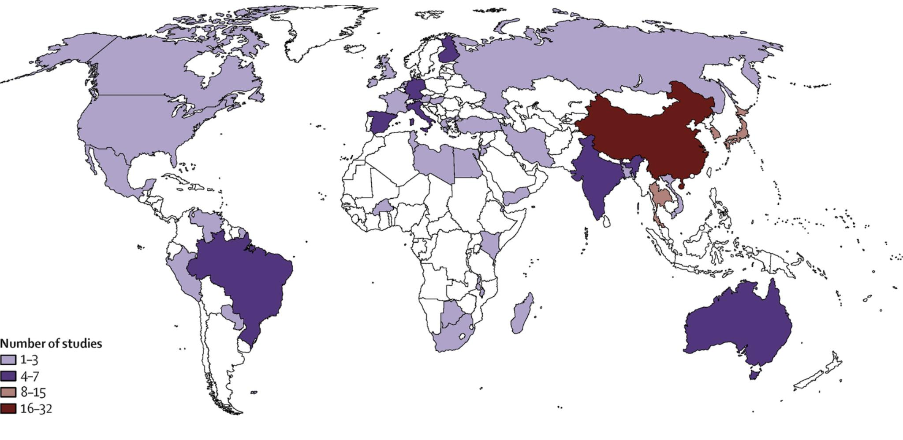{width="350"}
:::
:::::

**Clinical Course** - Duration 3-8 days - Often more severe than
norovirus - Dehydration: primary complication

::: notes
Before rotavirus vaccines, rotavirus was the leading cause of severe
diarrhea in children globally. It caused significant morbidity and
mortality, particularly in developing countries. The introduction of
rotavirus vaccines (RotaTeq and Rotarix) has dramatically changed the
epidemiology in countries with immunization programs. Rotavirus is still
a significant problem in areas without vaccine access. Understanding
rotavirus remains important because breakthrough infections occur, and
healthcare workers still encounter it in unvaccinated or incompletely
vaccinated children.
:::

## Rotavirus Pathophysiology

**Viral Characteristics** - 70 nm non-enveloped RNA virus (Reoviridae
family) - Segmented genome with multiple genes encoding virulence
factors

::: incremental
**Mechanisms of Diarrhea** - Villus shortening and disruption -
Brush-border enzyme deficiency (lactase, sucrase) - Calcium-dependent
enterotoxin production (NSP4) - Impaired water and ion absorption
:::

::: notes
Rotavirus's pathophysiology is complex and explains some clinical
features. The villus disruption impairs absorption and leads to
nutritional losses. The enterotoxin activates fluid secretion,
contributing to large stool volumes. The brush-border enzyme deficiency
explains why secondary lactose intolerance is common—the damaged
epithelium cannot produce lactase, so milk products worsen diarrhea
temporarily. This has clinical implications for nutritional management.
Understanding that diarrhea is multifactorial (invasive plus secretory
mechanisms) helps explain why rotavirus can be more severe than purely
secretory pathogens.
:::

## Rotavirus Vaccines

**Available Vaccines**

::::: columns
::: {.column width="50%"}
**RotaTeq (Pentavalent)** - Manufactured by Merck - 3-dose series - RV1,
RV2, RV3, RV4, RV5
:::

::: {.column width="50%"}
**Rotarix (Monovalent)** - Manufactured by GSK - 2-dose series - RV1
genotype coverage
:::
:::::

**Impact on Disease** - Dramatic reduction in hospitalizations (\>90%)
[@Vesikari2006; @Ruiz-Palacios2006] - \$1.2 billion in healthcare cost
savings in US per year - Significant reduction in mortality globally in
vaccinated populations

::: notes
Rotavirus vaccines are among the most cost-effective vaccines available,
particularly in developing countries where rotavirus mortality is
highest. Both available vaccines are live attenuated oral vaccines given
to infants. The vaccines are highly effective at preventing severe
disease, though breakthrough infections with milder symptoms can occur.
Vaccination programs have transformed rotavirus epidemiology in
developed countries, shifting disease from young children to
occasionally-affected vaccinated children with milder disease. Global
expansion of rotavirus vaccination remains a key public health priority
given the ongoing burden in unvaccinated populations.
:::

## Rotavirus — Key Clinical Points

**Typical Presentation** - Watery, non-bloody diarrhea - Vomiting less
prominent than with norovirus - Respiratory symptoms occasionally
present (suggests dual viral infection)

**Risk Factors for Severe Disease** - Age \<24 months - Malnutrition -
Lack of prior exposure/vaccination - Comorbid conditions

**Epidemiology** - Common in daycare settings - Seasonal: winter months
and dry seasons in temperate climates

::: notes
In clinical practice, rotavirus typically presents in young children
with watery diarrhea and dehydration. The absence of prominent vomiting
(compared to norovirus) doesn't mean vomiting doesn't occur—it's just
less frequent. Rotavirus commonly spreads through daycare centers; it's
a reportable condition in many jurisdictions for this reason. The
seasonal pattern varies by geography but generally corresponds to
cooler, drier months in temperate zones. Most rotavirus infections in
vaccinated populations are mild; when you see severe rotavirus disease
in a developed country, consider vaccination status or immunocompromise.
:::

## Other Viral Pathogens

| Virus | Age Group | Key Features |
|------------------|------------------------|------------------------------|
| Sapovirus | Children | Similar to norovirus; outbreaks |
| Astrovirus | Young children | Milder than rotavirus |
| Adenovirus 40/41 | Infants/toddlers | Winter seasonality |
| Enteroviruses | Variable | Rash sometimes present |
| Coronaviruses (SARS-CoV-2) | All ages | Mild GI symptoms often with respiratory |

::: notes
This table summarizes other viral pathogens that cause diarrhea. While
less common than norovirus and rotavirus in most settings, these agents
still cause significant disease. Sapovirus resembles norovirus
clinically and epidemiologically. Astrovirus and Adenovirus 40/41 are
primarily pediatric pathogens. Enteroviral infections may have systemic
manifestations beyond GI symptoms. The COVID-19 pandemic has reminded us
that respiratory viruses can cause GI symptoms; in fact, GI symptoms
were present in 10-30% of early COVID-19 cases. All viral
gastroenteritis is primarily managed with supportive care.
:::

## Enterotoxigenic E. coli (ETEC) Overview

**Epidemiology & Pathogenesis** - Leading cause of acute diarrhea in
developing countries [@Qadri2005] - Survives in water; transmitted via
contaminated food/water - Produces enterotoxins: heat-labile (LT) and
heat-stable (ST) toxins

**Clinical Presentation** - Watery diarrhea, often dehydrating - Nausea
common; vomiting less frequent - Fever absent or mild - Duration
typically 3-5 days

::: notes
ETEC is the most common cause of traveler's diarrhea in many
destinations. Understanding the toxin-mediated mechanism explains the
large-volume watery stools—these are secretory diarrhea similar to
cholera. The lack of fever or prominent systemic symptoms helps
distinguish ETEC from invasive pathogens. ETEC survives environmental
conditions better than many Salmonella or Shigella strains, making it
particularly problematic in areas with poor water treatment. The
prevalence varies geographically; understanding regional epidemiology
guides empiric therapy when treating traveler's diarrhea.
:::

## ETEC Toxins and Mechanisms

::::: columns
::: {.column width="50%"}
**Heat-Labile Toxin (LT)** - Similar to cholera toxin - Activates
adenylate cyclase - Increases cAMP - Stimulates secretion
:::

::: {.column width="50%"}
**Heat-Stable Toxin (ST)** - Smaller molecular weight - Activates
guanylate cyclase - Increases cGMP - More tissue-specific
:::
:::::

**Result**: Increased intestinal cyclic nucleotides → electrolyte and
water secretion → watery diarrhea

::: notes
The toxin-mediated secretory mechanism explains the clinical and
pathophysiologic features of ETEC infection. Both toxins work through
G-protein coupled signaling but use different second messengers. The LT
toxin's similarity to cholera toxin means the diarrhea can be severe and
dehydrating. Importantly, the epithelial barrier remains intact in
toxin-mediated disease—there's no blood in stool and no invasive
infection. This has implications for prognosis and treatment; most
patients recover with rehydration alone. The toxins are heat-stable or
heat-labile, explaining why food preparation temperature matters in
transmission prevention.
:::

## Other Pathogenic E. coli Strains

**EPEC (Enteropathogenic E. coli)** - Primarily affects children \<6
months - Contains Eae gene encoding adhesin - Causes attaching and
effacing lesions - Non-bloody watery diarrhea

**EIEC (Enteroinvasive E. coli)** - Invasive mechanism similar to
Shigella - Bloody diarrhea with systemic symptoms - Fever and abdominal
pain common

**EAEC (Enteroaggregative E. coli)** - Biofilm formation on epithelium -
Causes persistent or chronic diarrhea (\>14 days) - Often associated
with travel to developing countries

::: notes
These pathogenic E. coli strains use different virulence mechanisms and
cause different clinical syndromes. EPEC is primarily a pediatric
pathogen in developing countries; in developed countries, you're more
likely to see ETEC in travelers. EIEC resembles Shigella clinically and
epidemiologically—it's invasive and causes dysentery. EAEC is notable
for causing persistent diarrhea, which has different implications for
testing and treatment than acute self-limited diarrhea. Distinguishing
between different pathogenic E. coli strains requires molecular testing;
they don't grow differently on routine culture media.
:::

## EHEC/STEC Overview

**Clinical Significance** - Shiga toxin-producing E. coli (STEC)
strains - E. coli O157:H7 most common in North America [@Karch2005] -
Multiple non-motile serotypes cause disease - Shiga toxin causes
microangiopathic hemolytic damage [@Tarr2005]

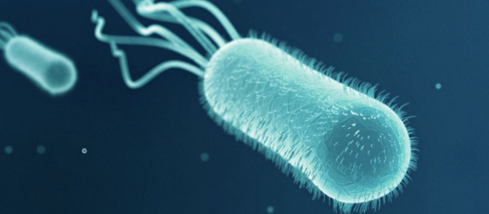{width="400"}

::: notes
STEC infections are notably important because of the potential for
life-threatening complications, particularly hemolytic uremic syndrome.
While the initial presentation is typically bloody diarrhea, the
systemic complications distinguish this from other bacterial diarrheal
pathogens. The Shiga toxins (Stx1 and Stx2) are AB toxins that inhibit
protein synthesis in endothelial cells, leading to thrombotic
microangiopathy. O157:H7 is serotypically identifiable but other STEC
strains (O103, O111, O26, O145) require molecular detection.
Understanding STEC is critical because antimicrobial therapy choice
directly impacts risk of complications.
:::

## Hemolytic Uremic Syndrome (HUS)

**STEC-Associated HUS** - Occurs in approximately 5-15% of STEC
infections - Often follows 3-5 days of hemorrhagic diarrhea - Triad:
microangiopathic hemolytic anemia, thrombocytopenia, acute kidney injury

**Prognosis and Sequelae** - 5-year outcomes: \~70% complete recovery -
Mortality: 1.4-2.9% - Chronic sequelae: renal dysfunction (8-50%),
neurological (5-25%), cardiac (5%)

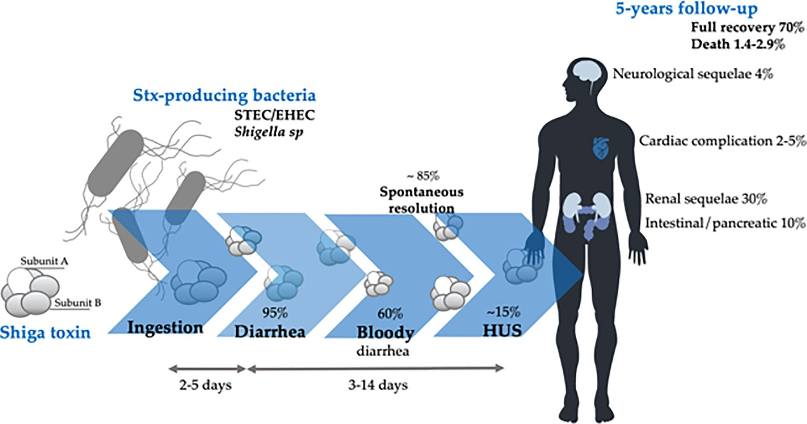{width="350"}

::: notes
HUS represents the most serious complication of STEC infection. The
pathophysiology involves Shiga toxin-mediated endothelial injury,
leading to platelet activation, fibrin deposition, and mechanical
hemolysis (schistocytes on blood smear). Children under 5 have higher
risk for HUS. While most survive, long-term follow-up studies show
significant rates of chronic kidney disease, hypertension, and
neurologic sequelae in survivors. This emphasizes the importance of
early recognition and avoiding therapies that increase risk of
progression to HUS.
:::

## HUS Management

**Critical Principle: Avoid Antibiotics** - Antibiotic use associated
with 25% increase in HUS risk - Proposed mechanism: bacterial lysis
releases Shiga toxin - Even fluoroquinolones and azithromycin increase
risk - Avoid antimotility agents

::: callout-warning
Do NOT treat STEC/EHEC diarrhea with antibiotics. Supportive care only.
:::

**HUS Management** - Renal replacement therapy: essential in \~50% of
cases - Blood product support: transfusions for anemia, platelets
carefully - Plasma exchange: controversial but may help neurologic
complications - ICU-level supportive care often required

::: notes
The association between antibiotics and HUS progression is one of the
most clinically important "don'ts" in infectious diseases. Multiple
studies have demonstrated this increased risk. The mechanism likely
involves stimulating toxin release during bacterial lysis. This creates
a clinical dilemma: the patient has severe bloody diarrhea suspicious
for bacterial infection, yet antibiotics may worsen outcomes. This is
why STEC identification and careful antibiotic stewardship matters. HUS
management is primarily supportive, with dialysis for renal failure and
careful fluid and electrolyte management. Plasmapheresis lacks robust
evidence but is sometimes used for neurologic manifestations.
:::

## EHEC Detection Methods

**Diagnostic Approaches** - Sorbitol MacConkey agar: STEC O157:H7
appears non-sorbitol fermenting (colorless) - Chromogenic agar:
substrate produces color with specific enzymes - EIA for Shiga toxins:
rapid detection from stool - PCR for Stx genes: confirmatory molecular
testing

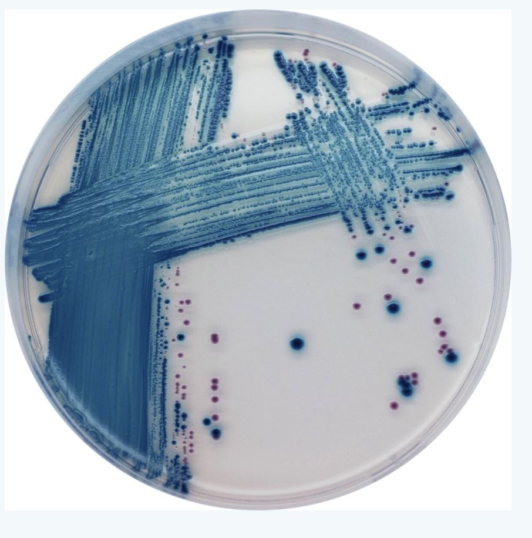{width="350"}

::: notes
Laboratory detection of STEC requires specific methodology. Routine
culture on standard media will miss many STEC strains. Sorbitol
MacConkey agar is the classic selective medium for O157:H7 detection;
the characteristic non-sorbitol fermentation creates a visible
phenotype. Chromogenic agar media have improved sensitivity and
specificity. Direct toxin detection by EIA is rapid and available at
many centers. PCR-based testing for Stx genes is increasingly standard
and can detect all STEC strains regardless of serotype. In a patient
with bloody diarrhea, suspicion for STEC should prompt specific
ordering—asking the lab to use selective media for STEC isolation.
:::

## EHEC Outbreaks — Germany 2011

**2011 Outbreak Details** - Strain: O104:H4 (unusual non-motile strain)
[@Rasko2011] - Total infected: 12,600 cases - HUS cases: 4,321 - Deaths:
50 (42 from HUS, 8 from sepsis)

**Unique Features** - Prophage carrying Stx gene plus additional
virulence genes - Multidrug resistance including fluoroquinolone
resistance - Foodborne outbreak traced to sprouts from Egypt - Deadliest
STEC outbreak in modern history

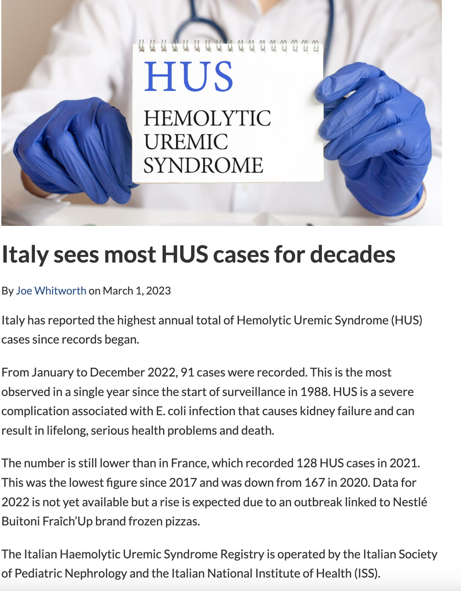{width="350"}

::: notes
The 2011 Germany outbreak illustrated the potential severity of STEC
infections and the challenges in outbreak investigation. The O104:H4
strain was unusual—it had a sorbitol-fermenting phenotype (unlike
O157:H7) combined with Shiga toxin production. The antifungal sprout
contamination was traced internationally, highlighting globalization of
food supply chains. The unusually high HUS rate (34% of cases) and
mortality reflected the particular virulence of this strain and possibly
the high proportion of adult cases (who have worse outcomes than
children). This outbreak led to increased surveillance for STEC and
highlighted the need for rapid molecular diagnostics during outbreaks.
:::

## Campylobacter Overview

**Epidemiology** - Most common bacterial cause of gastroenteritis
globally [@Kaakoush2015] - Primarily Campylobacter jejuni (90% of
infections) - Also: C. coli, C. lari, and other species

{width="350"}

**Characteristics** - Gram-negative, microaerophilic curved rod -
Minimal growth on routine culture media - Fastidious organism; requires
special handling

::: notes
Campylobacter is arguably the leading bacterial cause of diarrhea in
developed countries, though because it's less reported than Salmonella
and Shigella, its true burden is underappreciated. It's fastidious and
easily missed on routine stool culture, requiring selective media and
microaerophilic conditions. The curved morphology is characteristic but
requires careful observation on microscopy or culture. Campylobacter
differs from other enteric pathogens in several ways: it colonizes
poultry without causing disease, it has seasonal variation, and it's
associated with some unique post-infectious syndromes like
Guillain-Barré syndrome.
:::

## Campylobacter Transmission

**Animal Reservoir** - Common commensal in poultry (colonizes GI
tract) - Also found in cattle, pigs, dogs, cats - Undercooked meat:
primary source - Unpasteurized milk: significant source

**Environmental Survival** - Survives in freshwater at temperatures
\<15°C - Sensitive to heat, desiccation, oxygen at room temperature -
Short survival in food chain; requires careful handling

**Direct Transmission** - Person-to-person transmission: uncommon but
documented - Fecal-oral route primarily - Animal contact risk factor

::: notes
Understanding Campylobacter's ecology helps with prevention counseling.
The organism's presence in poultry is ubiquitous; estimates suggest
50-90% of retail chicken is colonized. Cooking to safe internal
temperatures kills the organism. Unpasteurized milk can be contaminated
by fecal shedding from infected animals. The organism's sensitivity to
environmental stresses (heat, oxygen) contrasts with some other
pathogens like Salmonella that are more robust. Direct animal contact,
particularly with puppies or chicks, is a documented risk factor. For
travelers, undercooked local poultry dishes are a common source.
:::

## Campylobacter Clinical Features

**Incubation Period** - Mean: 3 days (range 1-7 days) - Longer than many
bacterial pathogens

**Typical Presentation** - Affects both small and large bowel → mixed
diarrhea pattern - Watery AND bloody diarrhea common - Febrile prodrome
in \~1/3 of cases (fever, malaise, myalgias) - Abdominal pain often
prominent and severe

**Systemic Complications** - Bacteremia in 0.1-1% (higher in
immunocompromised) - Septic arthritis, osteomyelitis, meningitis
(rare) - Post-infectious syndromes (see next slide)

::: notes
Campylobacter's clinical presentation is diverse. The fever and severe
abdominal pain can sometimes lead to concern for appendicitis or other
surgical abdomen; one must maintain a high index of suspicion and send
stool cultures in appropriate patients. The combination of watery and
bloody stool reflects both secretory toxin production and mucosal
invasion. The relatively long incubation period compared to norovirus
helps differentiate it in outbreak investigations. Most infections are
community-acquired from dietary exposure rather than person-to-person
spread.
:::

## Campylobacter Complications

**Post-Infectious Complications**

::::: columns
::: {.column width="50%"}
**Guillain-Barré Syndrome (GBS)** - Estimated 3-40% of GBS cases linked
to prior Campylobacter [@Nachamkin1998] - Mechanism: molecular mimicry -
Antibodies cross-react with GM1 ganglioside - Ascending paralysis 1-3
weeks after diarrhea
:::

::: {.column width="50%"}
**Reactive Arthritis** - Occurs in 2.6% of infections - HLA-B27
association - Arthralgia/arthritis weeks after diarrhea - Can be
prolonged and disabling
:::
:::::

::: notes
The association between Campylobacter and Guillain-Barré syndrome is
important clinically. GBS is a post-infectious autoimmune complication
that develops after the acute diarrhea has resolved, typically 1-3 weeks
later. The molecular mimicry mechanism reflects LPS epitopes on certain
Campylobacter strains that resemble human nerve tissue. This
complication emphasizes that some patients with Campylobacter infection
experience significant morbidity beyond the acute gastroenteritis.
Reactive arthritis is another post-infectious syndrome; like GBS, it
develops after the acute illness and requires different management
focused on the joint inflammation rather than the infectious diarrhea.
:::

## Campylobacter Diagnosis

**Laboratory Detection** - Stool culture on selective media (Campy agar,
CCDA agar) - Requires microaerophilic conditions - Gram-negative,
S-shaped or curved rods on microscopy - Culture takes 48-72 hours
minimum

**Molecular Methods** - PCR increasingly available at reference labs -
Rapid diagnosis possible - Higher sensitivity than culture

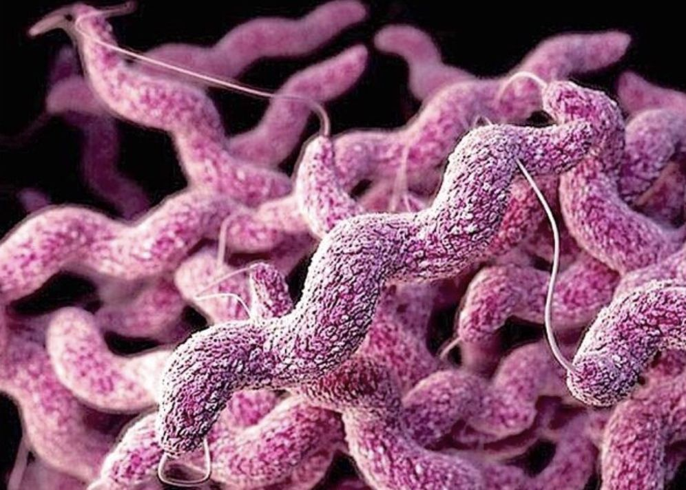{width="350"}

::: notes
Campylobacter detection requires communication with the laboratory about
your clinical suspicion. If you simply request "stool culture," many
labs use routine media where Campylobacter won't grow well. Specifically
requesting Campylobacter culture ensures appropriate media and
conditions are used. The organism's fastidious nature explains why it
was historically underdiagnosed. Modern PCR-based methods are
increasingly available and offer rapid diagnosis with better sensitivity
than culture. In outbreak investigations, PCR and sequencing can provide
strain typing information important for source investigation.
:::

## Salmonella Overview

**Epidemiology** - Motile gram-negative Enterobacterales -
Non-typhoidal: common cause of gastroenteritis [@Majowicz2010] -
Typhoidal (S. typhi, S. paratyphi): invasive systemic illness
[@Crump2015]

**Diversity** - \>1,400 serotypes identified - Two major clinical
syndromes: gastroenteritis vs. enteric fever - Highest incidence
globally: South Asia

::: notes
Salmonella is diverse in both its serotypes and clinical presentations.
Understanding whether you're dealing with non-typhoidal gastroenteritis
or enteric fever (typhoid) is crucial for prognosis and treatment.
Non-typhoidal Salmonella causes self-limited gastroenteritis in most
immunocompetent hosts. Typhoidal Salmonella causes invasive systemic
infection with distinctive clinical features. The epidemiology differs:
non-typhoidal disease is common in developed countries from food
contamination, while typhoidal disease is primarily seen in travelers
from endemic areas or in endemic regions with poor water sanitation.
:::

## Non-typhoidal Salmonella Epidemiology

**Serotype Distribution** - S. Enteritidis: most common globally - S.
Typhimurium: second most common - Both associated with poultry and
poultry products - Transovarial transmission in hens explains egg
contamination

**Geographic & Seasonal Patterns** - Incidence highest in South and
Southeast Asia - Seasonal peaks: summer and autumn in temperate
climates - Year-round in tropical regions

::: notes
The predominance of S. Enteritidis and S. Typhimurium reflects the
importance of poultry in global food supply. The discovery of
transovarial transmission (passage of bacteria through the ovaries to
contaminate eggs) was important because it explained why even properly
handled eggs could transmit disease. The seasonal pattern in temperate
climates likely relates to food handling practices and temperature
effects on bacterial growth. In developing countries with endemic
typhoid, non-typhoidal Salmonella remains important but is often
overshadowed epidemiologically by the burden of typhoid fever.
:::

## Non-typhoidal Salmonella Transmission

**Primary Transmission Routes** - Contaminated poultry and poultry
products (eggs, meat) - Cross-contamination in food preparation -
Unpasteurized dairy products

**Animal Contact Transmission** - Reptiles (turtles, iguanas, snakes):
significant source in households - Direct contact with infected
animals - Fomite transmission from contaminated surfaces

**Person-to-Person Transmission** - Fecal-oral route - More common in
young children \<5 years - Healthcare-associated outbreaks possible

{width="350"}

::: notes
Reptile-associated Salmonella is an underappreciated source in developed
countries, particularly among children who have pet turtles or iguanas.
Public health campaigns have promoted awareness, but reptile ownership
continues to result in Salmonella infections. Understanding transmission
routes helps guide prevention counseling with patients. The ability to
transmit via fomites means that handwashing and food handling hygiene
are critical. In immunocompromised patients and very young children,
person-to-person transmission risk is higher, explaining why
healthcare-associated outbreaks can occur.
:::

## Non-typhoidal Salmonella Clinical Features

**Incubation Period** - 8-72 hours (typically 12-36 hours)

**Typical Presentation** - Diarrhea with abdominal pain and cramping -
Fever in \~50% (often high—\>39°C) - Nausea and vomiting common -
Systemic symptoms: malaise, headache

**Risk Factors for Severe Disease** - Extremes of age (\<5 or \>65
years) - Achlorhydria or antacid use - Inflammatory bowel disease -
Sickle cell disease - Immunosuppression

**Prognosis** - Self-limited in immunocompetent hosts - Bacteremia in
\<5% (higher with underlying conditions) - Duration typically 4-7 days

::: notes
Most non-typhoidal Salmonella gastroenteritis is indistinguishable from
other bacterial causes of diarrhea. The fever, abdominal pain, and
watery diarrhea constitute a typical presentation. Risk factors for
invasive disease and bacteremia guide clinical decision-making about
antimicrobial therapy. Achlorhydria increases risk because stomach acid
normally kills some bacteria; patients on acid suppression therapy are
at increased risk. Inflammatory bowel disease predisposes to invasive
infection. Sickle cell patients have particularly high risk for
non-typhoidal Salmonella bacteremia and extraintestinal infection like
osteomyelitis. These risk factors influence management decisions.
:::

## Non-typhoidal Salmonella — Asymptomatic Carriage

**Chronic Carriers** - Definition: shedding bacteria \>1 year after
infection - Prevalence: 0.6-2% of infected individuals - More common
with S. Enteritidis than other serotypes - Risk factors: female sex,
older age, biliary disease

**Clinical Implications** - Potential source for transmission to
others - Important for food handlers and healthcare workers - Prolonged
antibiotics (e.g., fluoroquinolone) may clear carriage - Cholecystectomy
eradicates infection in some biliary carriers

::: notes
Asymptomatic carriage represents an important public health
consideration. While most infected people shed for days to weeks, a
small proportion become chronic carriers. For food handlers, carriage
poses ongoing transmission risk. The association with biliary disease
suggests that bacteria persist in the biliary system. Treatment of
chronic carriers is controversial—most guidelines don't recommend
treatment unless the person is a food handler or healthcare worker with
direct patient contact. When treatment is attempted, prolonged
fluoroquinolone courses may be used, though success rates vary.
:::

## Enteric/Typhoid Fever

**Epidemiology** - Caused by Salmonella typhi (endemic in South Asia,
Africa) - Also S. paratyphi (Asia-Pacific region) - Humans are the only
reservoir - \~21 million cases and 200,000 deaths annually globally -
Mortality 1-4% with treatment; 20-30% without

**Risk Factors for Acquisition** - Travel to endemic areas (South Asia
especially) - Poor sanitation exposure - Close contact with chronic
carriers

::: notes
Typhoid fever is an invasive systemic infection distinct from
non-typhoidal gastroenteritis. It's primarily a disease of developing
countries with inadequate sanitation. For travelers to endemic areas,
typhoid represents a significant health risk. The clinical syndrome
develops gradually over days to weeks, distinct from the acute onset of
non-typhoidal Salmonella. Understanding the stepwise progression of
symptoms helps in early diagnosis and treatment.
:::

## Typhoid Fever — Clinical Progression

**Week 1: Septicemia Phase** - Gradual fever onset (prodrome over
days) - High fever develops, continuing to rise - Bacteremia present -
Relative bradycardia (unusual for degree of fever) - Malaise, headache,
myalgias

**Week 2-3: Systemic Phase** - Sustained high fever (often continuous
pattern—"staircase fever") - Rose spots rash (evanescent, 2-3mm
rose-colored papules on trunk) - Hepatosplenomegaly - Abdominal pain and
distension - Diarrhea or constipation

**Week 3-4: Crisis Phase** - Risk of intestinal perforation (Peyer's
patches ulcerate) - Septic shock possible - Delirium and altered mental
status ("typhoid state") - Myocarditis, pneumonia

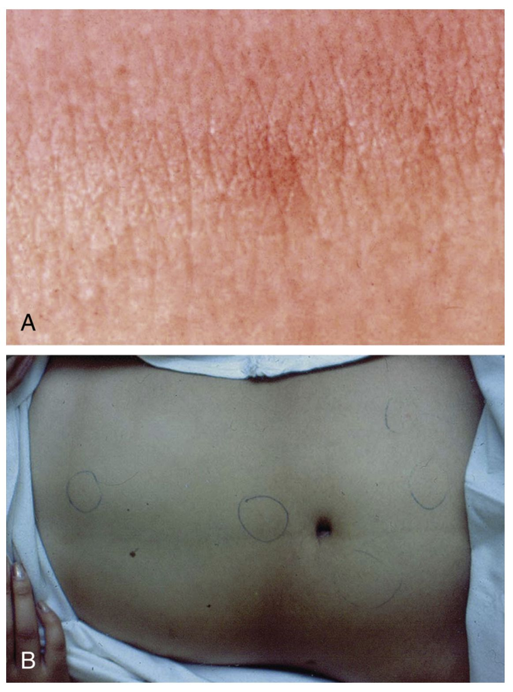{width="300"}

::: notes
The clinical progression of typhoid is relatively stereotyped, though
individual variation occurs. The gradual fever onset over several days
distinguishes it from acute gastroenteritis. The relative bradycardia—a
slower heart rate than expected for the degree of fever—is a classic but
often-missed finding. Rose spots are pathognomonic but occur in only
15-30% of cases, so their absence doesn't exclude diagnosis. The
complications of perforation and septic shock typically occur in the
third week if untreated. Understanding this timeline helps guide
diagnostic timing and empiric therapy decisions.
:::

## Typhoid Fever — Treatment

**Antimicrobial Challenges** - Fluoroquinolone resistance increasing in
South Asia - Multidrug-resistant strains (TMP/SMX, chloramphenicol,
ampicillin) common - Extensively drug-resistant (XDR) strains emerging

**Treatment Options** - **First-line (susceptible)**: Fluoroquinolone
(ciprofloxacin) - **Alternatives**: Third-generation cephalosporins
(ceftriaxone, cefixime) - **Resistant strains**: Azithromycin (5-day
course) for nalidixic acid-resistant strains - **Duration**: 7-14 days
depending on severity and response

**Prognosis with Treatment** - Defervescence typically 4-6 days after
starting therapy - Relapse possible 1-2 weeks after apparent cure -
Follow-up cultures recommended to document clearance

::: notes
Typhoid treatment has become more complex due to emerging resistance
patterns. Recent surveys from the Indian subcontinent show 40-80%
resistance to fluoroquinolones in some regions. This means empiric
therapy choices must consider local epidemiology. Fluoroquinolones
remain reasonable empirically in many regions but may fail in endemic
areas of resistance. The emergence of XDR typhoid in Pakistan in recent
years is concerning and may require cephalosporins as first-line. The
delayed response to therapy (4-6 days for fever to resolve) requires
clinical judgment about treatment failure versus expected slow response.
Relapse in 5-10% of cases means follow-up is important.
:::

## Shigella Overview

**Microbiology** - Non-motile gram-negative Enterobacterales - Four
serogroups: dysenteriae, flexneri, boydii, sonnei [@Kotloff2018] -
Humans are the only reservoir (crucial difference from Salmonella)

**Clinical Significance** - Third most common bacterial cause of
diarrhea (after Salmonella and Campylobacter) - Associated with severe
dysentery and complications - Rapid person-to-person spread in closed
environments

::: notes
Shigella's restriction to humans as reservoir has important
epidemiologic implications. Unlike Salmonella with its animal reservoir
or Campylobacter with widespread animal colonization, Shigella is
person-to-person spread. This makes it particularly problematic in
crowded conditions, daycare, and institutions. The serogroups vary
geographically; S. flexneri and S. sonnei are most common in developed
countries, while S. dysenteriae (which produces Shiga toxin) is
important in developing regions.
:::

## Shigella Pathophysiology and Complications

**Virulence Mechanisms** - Invasion of colonic epithelium (ipaB, ipaC
genes) - Intracellular multiplication - Abscess formation and mucosal
ulceration - Enterotoxin production: ShET1, ShET2

**Complications** - Shiga toxin produced by S. dysenteriae → HUS
possible - HUS occurs in \~8% of children with S. dysenteriae
infection - Toxic megacolon (rare) - Protein-calorie malnutrition from
persistent diarrhea - Seizures, febrile delirium (especially in
children)

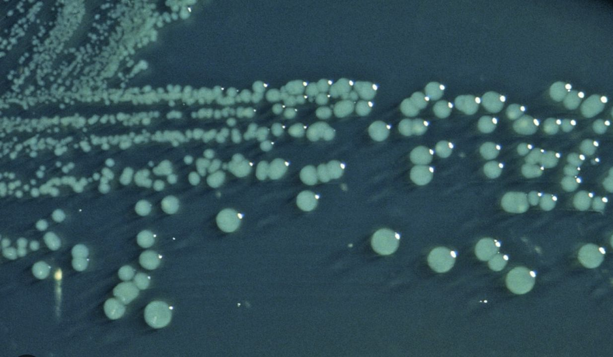{width="350"}

::: notes
Shigella's invasive mechanism explains the dysentery (bloody diarrhea)
seen in infection. The bacteria invade through M cells in Peyer's
patches, then spread laterally in the epithelium, causing abscesses and
ulcerations visible on colonoscopy. The production of enterotoxins
contributes to secretory diarrhea. S. dysenteriae type 1 produces Shiga
toxin, creating risk for HUS similar to STEC. The systemic
manifestations (seizures, delirium) are more common in children with
shigellosis than with other bacterial diarrheal pathogens.
:::

## Shigella Diagnosis and Treatment

**Laboratory Diagnosis** - Stool culture on selective media (HE agar,
XLD agar) - Preferred: culture from mucoid/blood-stained stool -
Non-motile gram-negative colonies - PCR for Stx gene (S. dysenteriae)

{width="350"}

**Resistance Patterns** - Asia/Africa: 20-30% resistance to
third-generation cephalosporins - TMP/SMX resistance: 65-85% in some
regions - Fluoroquinolone resistance increasing (esp. S. sonnei in Asia)

**Treatment** - First-line: Fluoroquinolone or ceftriaxone (when
fluoroquinolone susceptibility uncertain) - Alternative: Azithromycin -
Duration: 5-7 days

::: notes
Shigella's high rates of antimicrobial resistance necessitate knowledge
of local epidemiology. In developed countries, fluoroquinolones remain
effective, but in many developing countries, resistance is common.
Third-generation cephalosporins maintain good coverage for most strains.
Macrolides are useful alternatives. Most shigellosis is self-limited
without therapy, but treatment is recommended in most circumstances
because it decreases duration of diarrhea and reduces person-to-person
transmission.
:::

## Shigella — When to Treat

**Standard Recommendation** - Most infections resolve without
antibiotics - Treatment doesn't significantly alter outcomes in
mild-moderate disease

**Treat When** - Immunocompromised patients (including HIV) - Severe
diarrhea or dysentery - Bacteremia or extraintestinal infection - High
risk for transmission (food handlers, daycare workers)

**Benefit of Treatment** - Decreases symptom duration by \~2 days -
Reduces fecal shedding (may reduce transmission) - Prevents
complications in vulnerable populations

::: notes
The decision to treat shigellosis should consider both individual
patient factors and public health implications. In an immunocompetent
host with mild diarrhea, empiric antibiotics aren't necessary. But in
daycare settings or when transmission is a concern, treatment reduces
shedding and spread. The duration of fecal shedding is important
clinically; untreated shigellosis may result in weeks of shedding, while
treatment reduces this substantially. For immunocompromised patients,
even moderate disease warrants treatment given risk of invasive
infection.
:::

## Yersinia

**Species of Clinical Importance** - Yersinia enterocolitica - Yersinia
pseudotuberculosis

**Key Characteristics** - Zoonotic infections: wild and domestic
animals - Transmission: undercooked pork, contaminated water - Can
survive refrigeration (cold enrichment aids culture)

**Clinical Features** - Watery diarrhea or dysentery - Distinctive:
pharyngitis in \~20% (pharyngitis-gastroenteritis pattern) - Acute
mesenteric lymphadenitis: can mimic appendicitis - Fever and abdominal
pain prominent - Can cause arthralgia (particularly HLA-B27 associated)

**Lab Diagnosis** - Culture on selective media (CIN agar) - Overgrowth
by normal flora; requires selective medium or cold enrichment

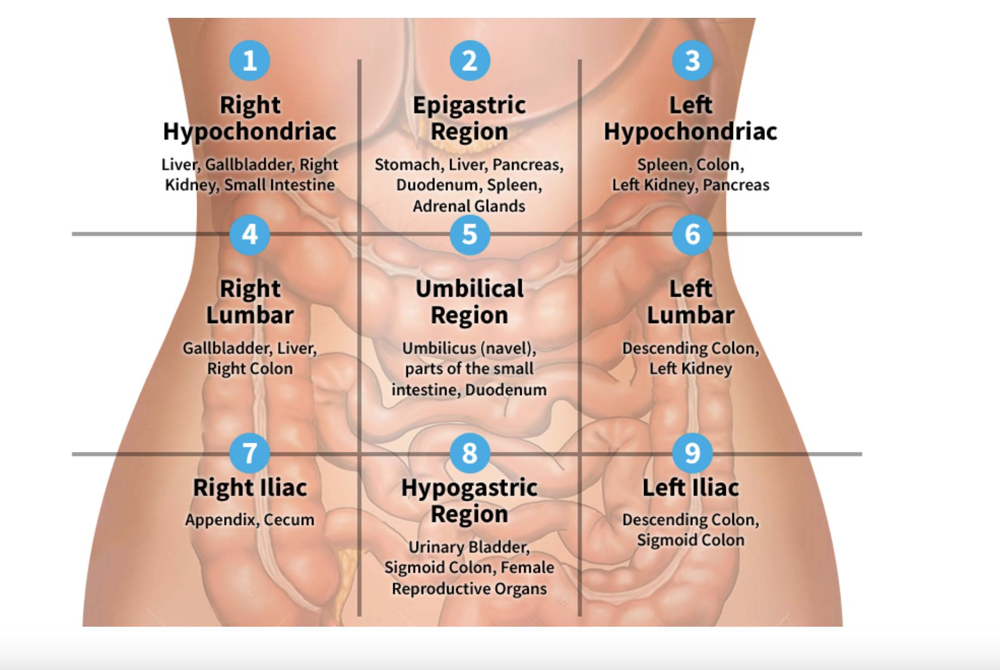{width="350"}

::: notes
Yersinia represents a less common cause of diarrhea but one with
distinctive features worth remembering. The combination of pharyngitis
with gastroenteritis is unusual and should raise suspicion for Yersinia.
The risk of acute mesenteric lymphadenitis misdiagnosed as appendicitis
is clinically important. Some patients undergo appendectomy before the
true diagnosis is made. The ability to survive refrigeration makes it a
potential concern with improperly stored food. Yersinia
pseudotuberculosis causes similar presentations and is geographically
variable.
:::

## Vibrio cholerae

**Epidemiology** - Endemic in South Asia (particularly Bangladesh,
India) [@Sack2004] - Seventh pandemic ongoing since 1961 - Transmitted
via contaminated water in areas with poor sanitation - Epidemic
potential high; 3-5 million cases, 100,000-300,000 deaths annually
[@Ali2015]

**Clinical Presentation** - Acute watery non-bloody diarrhea -
Characteristic "rice-water stools" (clear, watery, with flecks) - Severe
dehydration and shock possible - Vomiting common - Can be fulminant with
progression to hypovolemic shock

::: notes
Cholera is primarily a disease encountered in endemic areas or during
humanitarian crises with disrupted water systems. In developed
countries, it's rare and usually associated with travel to endemic
regions or consumption of raw seafood from contaminated waters. The
toxin-mediated secretory diarrhea can be massive—patients may produce
10-20 liters of stool daily. The fulminant nature of severe cholera
means rapid fluid replacement is lifesaving. The rice-water appearance
of stool is distinctive and related to the massive secretion of
electrolyte-rich fluid with minimal cellular debris.
:::

## Cholera Management

**Diagnostic Approach** - Culture on TCBS (Thiosulfate-Citrate-Bile
Salts) agar - Oxidase-positive, gram-negative curved rods - PCR
available at reference labs

**Treatment — Fluid Replacement is Paramount** - Oral rehydration
solution (ORS) is first-line - IV fluids (normal saline or Ringer's
lactate) for severe dehydration - Replacement volumes can be massive
(10-20 L/day in severe cases) - Monitor for electrolyte abnormalities

**Antimicrobial Therapy** - Decreases duration and volume of diarrhea -
Doxycycline, fluoroquinolones, or azithromycin - Secondary to fluid
replacement in priority

**Prevention** - Vaxchora: oral cholera vaccine for travelers to endemic
areas - Provides \~90% protection for 3 months, wanes thereafter - Food
and water precautions essential

::: notes
Cholera treatment emphasizes the critical importance of aggressive fluid
replacement. With appropriate rehydration, mortality is \<1%; without
it, mortality exceeds 50%. The vaccine (Vaxchora) is a live attenuated
vaccine given orally; it's not routinely recommended for all travelers
but is appropriate for those spending extended time in endemic areas at
high risk of exposure. For public health response to cholera outbreaks,
both treatment infrastructure and cholera vaccination programs are
important.
:::

## Traveler's Diarrhea — Overview

**Epidemiology** - Affects 300-500 million travelers annually - Attack
rate varies by destination: 5-50% depending on region [@Steffen2015] -
Onset typically 5-15 days after arrival in endemic region - Duration
usually 1-5 days (self-limiting in 90%)

**Clinical Presentation** - Watery diarrhea most common (80%) - Some
bloody stools possible (10-20%) - Fever in 20-30% - Cramping abdominal
pain - Systemic symptoms mild

**Definition** - ≥3 unformed stools in 24 hours plus 1+ GI symptom -
Occurring in someone traveling to area of higher risk

::: notes
Traveler's diarrhea is so common that prevention and self-management
strategies are critical counseling points for patients planning travel.
Most cases are mild and self-limited, but some can be severe enough to
disrupt travel plans. The pathogenesis is multifactorial: combination of
unfamiliar microbiota, altered diet, dehydration, and exposure to
enteropathogens. The risk varies dramatically by destination; highest
risk areas include Latin America, Africa, Middle East, and South Asia.
Lower-risk destinations include Northern Europe, Australia, New Zealand,
and North America.
:::

## Traveler's Diarrhea — Etiology by Region

| Pathogen                   | Frequency | Geographic Notes                 |
|----------------------------|-----------|----------------------------------|
| ETEC                       | 40-50%    | Most common worldwide            |
| Campylobacter jejuni       | 5-30%     | Higher in Asia                   |
| Salmonella spp.            | 5-20%     | Variable by region               |
| Shigella spp.              | 5-15%     | Higher in developing regions     |
| Enteroinvasive E. coli     | 5-10%     | Variable                         |
| Protozoa (Giardia, Crypto) | 2-5%      | More in rural areas              |
| Viral                      | 5-10%     | Norovirus, Rotavirus, Adenovirus |
| Noninfectious              | 10-20%    | Dietary changes, altitude        |

::: notes
The etiology of traveler's diarrhea varies by geographic destination and
season. ETEC remains the most common identified cause overall. In Asia,
Campylobacter is proportionally more common. Understanding regional
epidemiology helps guide empiric therapy if the patient becomes ill
while abroad. For most travelers, the illness is self-limited and
doesn't require laboratory diagnosis or specific therapy. The proportion
of noninfectious causes (stress, diet changes, altitude) is often
underappreciated—not all traveler's diarrhea is infection.
:::

## Traveler's Diarrhea — Prevention

**Food and Water Precautions** - Drink bottled or boiled water - Avoid
ice, raw vegetables, raw/undercooked meat - Peel own fruits - Avoid
street food and unpasteurized dairy

**Antimicrobial Prophylaxis** - Not routinely recommended (resistance,
adverse effects) - Consider for high-risk patients (immunocompromised,
severe underlying disease) - Bismuth subsalicylate: effective
prophylaxis (2 tablets QID) - Duration: maximum 3 weeks

::: notes
Food and water safety counseling is the most important prevention
strategy. Travelers should be cautious about water quality even in urban
areas; boiling, bottled water, or water purification tablets provide
protection. The decision to use antimicrobial prophylaxis should be
individualized. For most healthy travelers, the small risk of side
effects outweighs benefits. Bismuth subsalicylate is effective
prophylaxis and well-tolerated. Fluoroquinolone prophylaxis is effective
but increases risk of resistance and adverse effects. Probiotics lack
convincing evidence for prevention.
:::

## Traveler's Diarrhea — Self-Treatment

**Treatment Options**

::::: columns
::: {.column width="50%"}
**Preferred Approach** - Azithromycin 500 mg once daily, 3 days
[@Riddle2017] - Covers ETEC, Campylobacter, Shigella - Lower resistance
rates than fluoroquinolones
:::

::: {.column width="50%"}
**Alternative Approaches** - Fluoroquinolone (levofloxacin,
ciprofloxacin) if available - Rifaximin 200 mg TID, 3 days
(non-absorbed, minimal resistance) - Combination: loperamide +
antibiotic
:::
:::::

**Symptomatic Therapy** - Loperamide (Imodium): effective for cramping -
Combine with antibiotic for faster resolution - Bismuth subsalicylate:
both treatment and symptomatic relief

::: notes
Self-treatment of traveler's diarrhea with antibiotics can dramatically
reduce duration and severity. Many travelers appreciate the ability to
carry antibiotics for self-treatment if symptoms develop. Azithromycin
is increasingly preferred over fluoroquinolones due to lower resistance
rates in many regions. Rifaximin, a non-absorbed rifamycin, is effective
against most causes and doesn't alter systemic microbiota, making it
attractive. The combination of a motility agent and antibiotic provides
both symptomatic relief and pathogen eradication. Counseling patients
about when to self-treat versus seek care is important; persistent
bloody diarrhea or fever warrants medical evaluation.
:::

## Diarrhea in HIV/AIDS

**Epidemiology** - Affects 30-60% of patients with AIDS (CD4 \<200)
[@Sanchez2005] - Incidence decreased markedly with antiretroviral
therapy - ART with immune reconstitution reduces diarrheal disease

**Infectious Etiologies in AIDS** - Cryptosporidium parvum: most common
parasitic cause - Cytomegalovirus: causes ulcerative colitis pattern -
Microsporidium: can cause chronic diarrhea - Mycobacterium avium
complex: systemic infection - Conventional pathogens remain common
(Salmonella, Campylobacter)

**Management** - Start/optimize antiretroviral therapy (most
important) - Ganciclovir for CMV colitis - Multipathogen testing
recommended - Empiric therapy based on CD4 count and epidemiology

::: notes
The epidemiology of diarrhea in HIV/AIDS has changed dramatically with
effective antiretroviral therapy. In resource-rich settings with
available ART, diarrheal disease in HIV patients has become uncommon.
However, in areas with limited ART access and in patients with
uncontrolled HIV replication, diarrhea remains a significant problem.
The CD4 count strongly predicts which pathogens are likely: at CD4
\>200, conventional pathogens dominate; at CD4 \<100, opportunistic
organisms like Cryptosporidium become common. The recognition that ART
is the most important "treatment" for opportunistic diarrheal disease
emphasizes the need for rapid virologic suppression.
:::

## Diarrhea in Transplant Recipients

**Frequency and Timing** - 50-80% of solid organ transplant (SOT)
recipients experience diarrhea - Varies by organ type and
immunosuppression level - Can occur months to years post-transplant

**Infectious Etiologies** - Clostridioides difficile: most common
infectious cause (9-20% incidence) [@McDonald2018] - Norovirus:
prolonged shedding common - Cryptosporidium, Giardia, Cyclospora -
Cytomegalovirus: ulcerative colitis pattern

**Noninfectious Causes** - Up to 66% of cases in some series -
Medication side effects (mycophenolate, tacrolimus) -
Sorbitol-containing medications - IBD-like inflammation (idiopathic)

**Diagnostic Approach** - Multipathogen testing essential (stool
culture, EIA, PCR) - Consider colonoscopy with biopsy - Address
immunosuppression optimization

::: notes
Diarrhea in transplant recipients presents diagnostic challenges because
the differential is broad and includes both infectious and noninfectious
causes. The immunosuppressive regimen predisposes to both conventional
and opportunistic pathogens. C. difficile is the most common infectious
cause, reflecting frequent antimicrobial exposure. Norovirus deserves
special mention because it can cause chronic infection with prolonged
viral shedding in transplant recipients. The high proportion of
noninfectious causes means that while ruling out infection is important,
many cases have medication-related or idiopathic causes requiring
adjustment of immunosuppression or medications.
:::

## Diarrhea in Immunocompromised Patients — General Approach

**Key Diagnostic Principles** - Identify etiologic agent whenever
possible (broad differential) - Multipathogen testing: stool culture,
parasitic studies, molecular panel - Lower threshold for colonoscopy and
biopsy - Consider unusual pathogens based on immune defect

**Treatment Considerations** - Pathogen-specific therapy when
identified - Avoid empiric broad-spectrum antibiotics when possible -
Address underlying immune defect (ART, immunosuppression optimization) -
Monitor for immune recovery inflammation (MAC disease, IRIS)

::: notes
Managing diarrhea in immunocompromised patients requires a systematic
approach. The differential diagnosis is much broader than in
immunocompetent hosts, including opportunistic pathogens that wouldn't
be considered in otherwise healthy people. The degree and type of immune
defect influences which pathogens are likely; CD4 count in HIV,
neutrophil count in chemotherapy patients, and immunosuppressive regimen
in transplant recipients all influence risk. Immune recovery
inflammatory syndrome (IRIS) can occur in HIV patients when CD4 count
recovers on ART, causing inflammatory diarrhea related to immune
reconstitution rather than persistent infection.
:::

## Hospital-Acquired Diarrhea

**Epidemiology** - Occurs in 10-15% of hospitalized patients -
Clostridioides difficile: most common infectious cause [@Lessa2015] -
Associated with increased morbidity, mortality, and healthcare costs

**Risk Factors** - Recent or current antimicrobial therapy (strongest
risk factor) - Advanced age - Severity of underlying illness - Prolonged
hospitalization - Immunosuppression

**Clinical Features** - Occurs after ≥3 days hospitalization - Watery
diarrhea most common - Fever, leukocytosis, abdominal pain - Can
progress to toxic megacolon or perforation

**C. difficile-Associated Disease** - Toxin-mediated disease (toxin A,
toxin B) - Antimicrobial exposure disrupts normal flora - Transmission
via spores: contact precautions required - Increasing incidence of
severe, recurrent disease

::: notes
Hospital-acquired diarrhea is a significant problem with major cost and
morbidity implications. C. difficile has emerged as the dominant
healthcare-associated pathogen, outpacing other nosocomial infections.
The key risk factor—antimicrobial therapy—is modifiable, highlighting
the importance of antimicrobial stewardship. The spore-forming nature of
C. difficile makes infection control challenging; standard hand
sanitizers are ineffective, and handwashing with soap and water is
required. Understanding C. difficile epidemiology and risk factors is
essential for all hospitalized patient care.
:::

## Diarrhea in Institutional Settings

**Long-Term Care Facilities** - One-third of residents experience
diarrhea annually - C. difficile most common - Rotavirus, G. lamblia
seasonal outbreaks - Norovirus rapid spread in winter - Nutritional
impact: worsens outcomes in elderly

**Daycare and School Settings** - Rotavirus common in young children
(prior to universal vaccination) - G. lamblia outbreaks in daycare -
Shigella spread via fecal-oral route - ETEC in contaminated water/food -
Exclusion policies important for control

**Neonatal Diarrhea** - Often caused by EPEC serotypes - Risk of severe
dehydration in newborns - Historical mortality 24-50%; now \<5% with
rehydration therapy - Insidious onset; requires high clinical
suspicion - May present with failure to thrive

::: notes
Institutional settings create unique epidemiology for diarrheal disease
due to crowding and transmission routes. In long-term care, the
combination of age, underlying illness, and antimicrobial exposure
creates high risk for severe disease. Outbreaks in these settings can
affect a large proportion of residents. Daycare and school settings show
different patterns; rotavirus was historically the major cause in
children before vaccination. Neonatal diarrhea remains a concern in
developing countries where it contributes to infant mortality. The
transition from acute watery diarrhea to failure to thrive can be
insidious, requiring vigilance in sick neonates.
:::

## Principles of Treatment — Rehydration

**Oral Rehydration Solution (ORS)** - First-line for mild-moderate
dehydration - WHO-recommended formulation: sodium 75 mmol/L, glucose 75
mmol/L, chloride 65 mmol/L, potassium 20 mmol/L - Effective for \>90% of
acute diarrhea cases

**Rehydration Approach** - Replace ongoing losses (10 mL/kg per stool) -
Add maintenance fluids - Early rehydration prevents severe dehydration -
Resume age-appropriate diet early

**IV Rehydration** - Reserved for severe dehydration, vomiting, shock -
Normal saline or Ringer's lactate preferred - Careful electrolyte
monitoring - Transition to oral when feasible

::: notes
Rehydration is the cornerstone of diarrheal disease treatment, and the
introduction of ORS has been transformative in reducing mortality from
diarrhea globally. The electrolyte composition of ORS is based on the
sodium-glucose cotransport mechanism in the small intestine, which
remains intact even in diarrheal disease. Most cases of acute diarrhea,
even with significant initial dehydration, can be managed with ORS.
Early feeding reduces diarrhea duration and prevents malnutrition. The
need for IV rehydration is reserved for cases with signs of shock,
persistent vomiting, or severe dehydration unable to drink.
:::

## Symptomatic Treatment

**Bismuth Subsalicylate (Pepto-Bismol)** - Reduces diarrheal volume by
30-50% - Antimicrobial properties against several pathogens - Useful for
both prophylaxis and treatment - Avoid in salicylate allergy; concern
for drug interactions - Useful in traveler's diarrhea management

**Antimotility Agents: Use with Caution** - Loperamide (Imodium):
effective for cramping - Risk: can precipitate toxic megacolon
(contraindicated in bloody diarrhea, fever, severe disease) - Never use
with suspected EHEC - Combined with antibiotics: effective for
traveler's diarrhea - Generally safe in mild, watery, non-inflammatory
diarrhea

**Probiotics** - Insufficient evidence for general recommendation - May
be role in specific contexts (antibiotic-associated diarrhea) - Not
harmful but not proven beneficial in most diarrhea

::: notes
Symptomatic management can improve patient comfort while allowing
natural resolution of infection. Bismuth subsalicylate has both
antimicrobial and symptomatic benefits, making it useful in traveler's
diarrhea. Antimotility agents require clinical judgment; they're safe in
uncomplicated watery diarrhea but contraindicated when there's concern
for invasive infection, fever, or bloody stools because they increase
risk of complications like toxic megacolon. The combined use of
antimotility agents with antibiotics in traveler's diarrhea deserves
special mention—this combination is very effective because the
antibiotic kills the pathogen and the antimotility agent reduces
symptoms. Probiotics remain controversial; some patients request them,
but evidence for benefit in acute diarrhea is limited.
:::

## When to Use Antibiotics

**Empiric Antibiotics Recommended For:** - Severe diarrhea (bloody,
fever, \>8 stools/day) - Diarrhea in immunocompromised patients -
Traveler's diarrhea (if symptomatic treatment not effective) - Suspected
invasive pathogen (Salmonella bacteremia, Shigella in systemically
ill) - Institutional outbreaks (control transmission)

**Avoid Antibiotics:** - Suspected or confirmed EHEC/STEC (increases HUS
risk) - Viral diarrhea - Mild, watery, non-bloody diarrhea in
immunocompetent hosts - Non-typhoidal Salmonella gastroenteritis in most
patients

**First-Line Empiric Choices** - Azithromycin 500 mg daily × 3 days
(preferred for traveler's diarrhea) - Fluoroquinolone (ciprofloxacin 500
mg BID × 3 days) where resistance is low - Adjust based on local
resistance patterns

::: notes
Antimicrobial stewardship principles apply to diarrheal disease
management. Not all diarrhea requires antibiotics; many cases resolve
faster with supportive care alone than with empiric therapy. The
decision to treat empirically should consider severity,
immunocompetence, and likelihood of bacterial infection. In developed
countries, most acute diarrhea is viral and self-limited, making empiric
antibiotics unnecessary. In areas with high rates of invasive bacterial
diarrhea and where hydration access is limited, empiric therapy may be
more appropriate. The critical exception is EHEC, where antibiotics
paradoxically worsen outcomes.
:::

## Micronutrient Supplementation

**Zinc Supplementation** - Particularly in children \<5 years in
developing countries [@Lazzerini2016] - Reduces duration and severity of
diarrhea - Decreases risk of subsequent infections for 2-3 months -
Dose: 10-20 mg elemental zinc daily for 10-14 days - Strong evidence
supports benefit, especially in malnourished children

**Other Micronutrients** - Vitamin A: benefit in deficient populations -
Iron: avoid during acute infection (may worsen) - Folate, B vitamins:
supportive during recovery

**Role in Developed Countries** - Less emphasis (better nutritional
status baseline) - Consider in malnourished or vulnerable populations -
Not harmful if administered

::: notes
Zinc supplementation during diarrheal illness has strong evidence for
benefit, particularly in developing countries where zinc deficiency is
common. The mechanism involves improved intestinal barrier function and
immune response. Even in developed countries, zinc supplementation
during severe or prolonged diarrhea may be beneficial, though the
evidence is less robust. The evidence for other micronutrient
supplementation is more limited. The key clinical point is that
nutritional support during and after diarrhea promotes recovery and
prevents complications like secondary infections and failure to thrive.
:::

## Key Take-Home Messages

::: incremental
1.  **Most diarrhea is viral and self-limited** — reserve specific
    testing and antibiotics for cases suggesting bacterial infection

2.  **Rehydration is the cornerstone of treatment** — ORS is highly
    effective and first-line for most cases [@Munos2010]

3.  **Identify patients needing hospitalization or antibiotics** — use
    clinical features, history, and exam to guide severity assessment
    and testing

4.  **EHEC/STEC demands special attention** — antibiotics are
    contraindicated and increase HUS risk

5.  **Geographic and risk-factor epidemiology matters** — tailor
    diagnostic approach and empiric therapy based on exposure history
    and patient factors
:::

::: notes
These core principles guide management of the thousands of patients with
diarrheal illness seen in clinical practice. The emphasis on rehydration
over antibiotics reflects the reality that most cases improve with
supportive care. The specific attention to EHEC reflects the potential
for harm from inappropriate treatment. Understanding epidemiology helps
avoid unnecessary testing while ensuring key pathogens aren't missed.
:::

## Clinical Decision Framework

**Step 1: Assess Severity** - Evaluate dehydration, vital signs,
systemic symptoms - Severe disease: bloody stools, high fever (\>39°C),
altered mental status, signs of shock

**Step 2: Obtain Targeted History** - Travel to endemic regions;
duration and type of exposure - Food/water exposure; sick contacts -
Immunocompromise; recent antibiotics - Medication review

**Step 3: Decide on Testing** - **Test if**: bloody diarrhea, fever
\>38.5°C, systemic illness, immunocompromised, \>7 days duration -
**Don't test**: mild watery diarrhea \<7 days, no red flags in
immunocompetent

**Step 4: Decide on Treatment** - Rehydration: first-line for all -
Antibiotics: only if criteria for bacterial infection met; avoid for
suspected EHEC - Symptomatic therapy: reasonable if no contraindications

::: notes
This framework provides structure for approaching the patient with
diarrhea in clinical practice. The initial assessment of severity
determines urgency and hospitalization needs. The history provides
crucial context—a traveler with diarrhea has different differential than
a hospitalized patient with diarrhea. Testing decisions should be
selective; routine cultures on every case of diarrhea are wasteful.
Treatment decisions flow from assessment of severity and likelihood of
bacterial infection. This systematic approach ensures appropriate
management while avoiding unnecessary testing and antibiotics.
:::

## References

::: notes
Key references for this lecture on infectious diarrheal diseases.
Additional citations throughout the slides support specific claims about
epidemiology, pathophysiology, and management. Readers should consult
current treatment guidelines for specific antimicrobial recommendations,
as resistance patterns change over time and vary geographically.
:::

-   Troeger C, et al. Estimates of the global, regional, and national
    morbidity, mortality, and aetiologies of diarrhea in 195 countries:
    a systematic analysis for the Global Burden of Disease Study 2016.
    Lancet Infect Dis. 2018.

-   Liu L, et al. Global, regional, and national causes of child
    mortality in 2000-13, with projections to inform post-2015
    priorities. Lancet. 2015.

-   Freedman SB, et al. Pediatric Gastroenteritis in Developed and
    Developing Countries. Gastroenterology. 2020.

-   Platts-Mills JA, et al. Pathogen-specific burdens of community
    diarrhoea in developing countries. Lancet Glob Health. 2015.

## Questions and Discussion

Thank you for your attention. Time for your questions and clinical
pearls to share from your experiences.

::: notes
This closing slide allows transition to interactive discussion with the
audience. The 90-120 minute lecture has covered the major pathogens
causing infectious diarrhea, their pathophysiology, epidemiology,
clinical features, diagnosis, and management. The focus throughout has
been on practical clinical decision-making that balances diagnostic
testing, antimicrobial therapy, and supportive care. Audience engagement
and discussion of local epidemiology and management challenges enhances
learning and allows tailoring to specific clinical contexts.
:::
