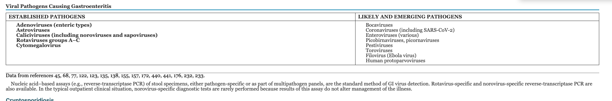
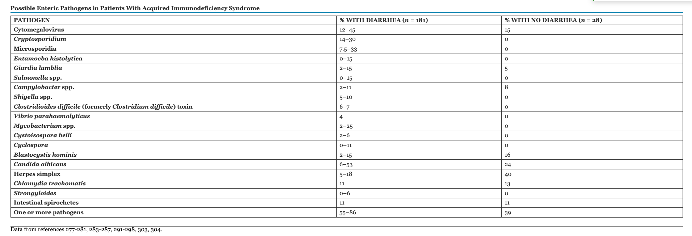
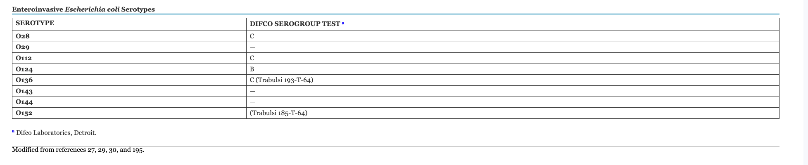
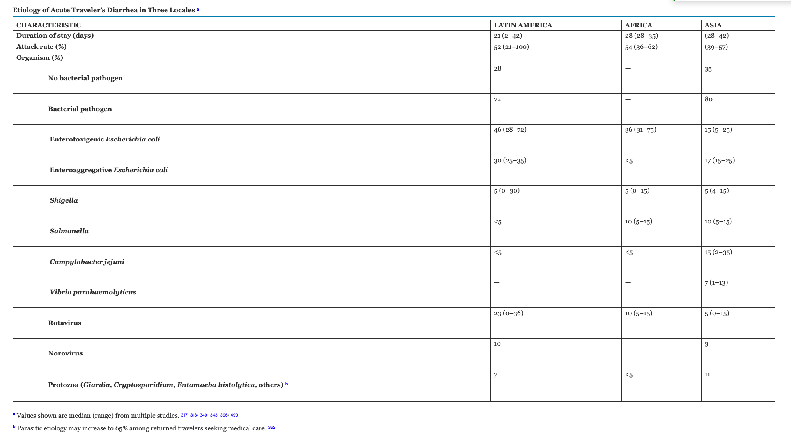
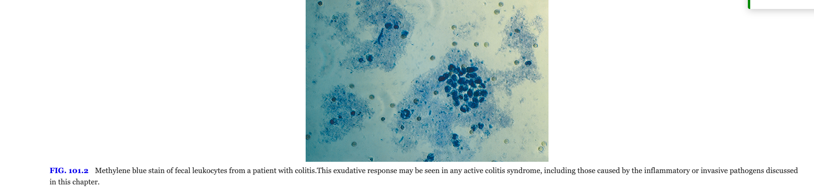
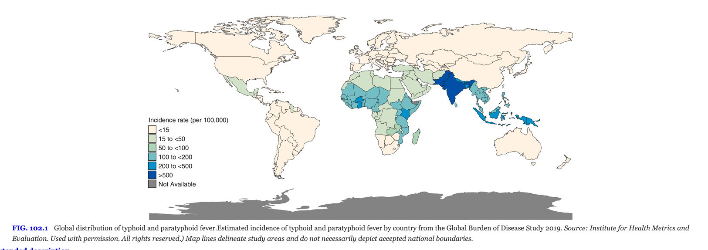
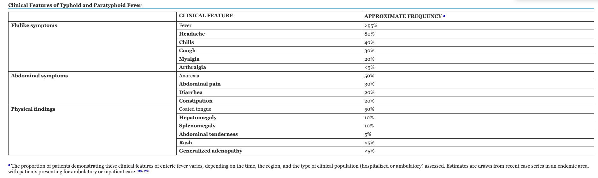

## 1. Introduction and Overview

Gastroenteritis represents one of the most prevalent infectious disease syndromes encountered in clinical practice worldwide. The global burden of enteric infections is staggering, with an estimated 4.5 billion episodes occurring annually across all populations. This immense disease burden reflects the ubiquitous nature of pathogens affecting the gastrointestinal tract and the challenges posed by inadequate sanitation, unsafe food and water supplies, and limited access to effective preventive measures in many regions.

The clinical presentation of infectious diarrhea varies considerably depending on the involved pathogen and the host's immune status. A fundamental distinction exists between two major pathophysiologic categories: inflammatory (or dysenteric) diarrhea and noninflammatory diarrhea. This classification has profound implications for diagnosis, treatment, and clinical management.

Noninflammatory diarrhea typically results from secretory mechanisms or osmotic effects caused by pathogens that do not directly invade or damage the intestinal epithelium. Such infections commonly present with watery stools, minimal abdominal cramping, and the characteristic absence of blood or inflammatory cells in stool samples. In contrast, inflammatory diarrhea involves direct mucosal invasion or toxin-mediated damage, leading to the presence of blood, mucus, and leukocytes in stool. This distinction guides both diagnostic approach and empiric management decisions.

::: {.callout-important}
## Clinical Pearl: Distinguishing Inflammatory from Noninflammatory Diarrhea

The presence of fever in combination with visible blood in the stool strongly suggests inflammatory diarrhea caused by invasive pathogens such as Salmonella, Shigella, Campylobacter, or enteroinvasive Escherichia coli. This clinical presentation should prompt evaluation for bacterial pathogens and consideration of antimicrobial therapy, whereas uncomplicated noninflammatory diarrhea often resolves without specific antimicrobial agents.
:::

## 2. Epidemiology of Acute Noninflammatory Diarrhea

The epidemiologic burden of acute diarrheal disease remains enormous despite advances in prevention and treatment. According to recent global health assessments, acute diarrheal illnesses resulted in approximately 1.6 million deaths globally in 2016, making diarrhea the eighth leading cause of death worldwide @Troeger2018. This mortality burden disproportionately affects children younger than five years of age, with the vast majority of these deaths occurring in low- and middle-income countries in sub-Saharan Africa and South Asia @Liu2016.

### Differential Disease Burden by Geographic Region

The pathogen-attributable burden of diarrheal disease varies significantly across geographic regions, reflecting differences in sanitation infrastructure, water quality, food safety practices, and healthcare access. In resource-abundant nations, enteroviruses and noroviruses predominate as etiologic agents. In contrast, less developed regions continue to experience substantial morbidity from bacterial pathogens, particularly enterotoxigenic E. coli (ETEC), Campylobacter jejuni, and non-typhoidal Salmonella species. The contribution of specific pathogens also varies seasonally, with viral pathogens showing winter predominance in temperate climates and less pronounced seasonality in tropical regions.

### Vulnerable Populations

Children under five years of age experience disproportionate disease burden, accounting for the majority of diarrhea-attributable mortality. In this population, severe dehydration and electrolyte abnormalities represent the primary life-threatening complications. Certain populations, including travelers to endemic regions, immunocompromised individuals, and residents of congregate living facilities, face substantially elevated risk for both acquisition and severe disease progression.

## 3. Community-Acquired Diarrhea

### 3.1 Acute Pediatric Diarrhea

#### Weanling Diarrhea and Infants

The period of transition from exclusive breastfeeding to other sources of nutrition (six to twenty-four months of age) represents a vulnerable time for diarrheal disease. The introduction of contaminated complementary foods, combined with declining passive immunity from breast milk, creates conditions favorable for infection. This period, termed the "weanling diarrhea" phase, accounts for substantial morbidity and mortality in resource-limited settings.

The protective effects of breastfeeding are well-established and multifactorial, resulting from both immunologic components (including secretory IgA, lactoferrin, and other antimicrobial proteins) and the hygiene benefits of direct nursing without intermediate contamination. Exclusive breastfeeding for the first six months of life substantially reduces the incidence and severity of infectious diarrhea.

#### Seasonality and Temporal Patterns

Diarrheal disease in pediatric populations demonstrates characteristic seasonal patterns, particularly in temperate climates where viral pathogens predominate during winter months. In tropical and subtropical regions, the seasonality is less pronounced or follows different patterns influenced by rainfall, temperature, and cultural practices affecting water and food safety.

### 3.2 Diarrhea in Adult Populations

Adult presentations of community-acquired diarrhea reflect different pathogen epidemiology compared to children. Noroviruses represent the most frequently identified cause of acute gastroenteritis in adults in resource-abundant settings, accounting for substantial numbers of outbreaks in closed environments such as hospitals, cruise ships, and long-term care facilities. The burden of norovirus disease in adults is substantial yet often underappreciated due to the general self-limiting nature of the illness.

Clostridioides difficile infection has emerged as an increasingly important cause of diarrhea in adult populations, particularly in healthcare settings but also in community settings. The epidemiology of C. difficile-associated disease continues to evolve, with increases in severity and recurrence noted in recent years.

Foodborne outbreaks attributable to Salmonella species remain common in developed nations, frequently associated with contaminated poultry products, eggs, and other animal-derived foods. Such outbreaks highlight the ongoing challenge of maintaining food safety even in industrialized countries with substantial regulatory oversight.

## 4. Viral Pathogens

{#fig-pathogen-etiologies width="90%"}

### 4.1 Rotavirus

{#fig-rotavirus width="80%"}

Rotavirus represents the most significant viral cause of severe diarrhea in young children worldwide, despite the introduction and implementation of rotavirus vaccines in many countries @Parashar2006. Prior to the vaccine era, rotavirus accounted for the vast majority of hospitalizations for severe diarrhea in infants and young children across all economic strata. Even in the post-vaccine era, rotavirus continues to cause substantial disease burden, particularly in regions where vaccine coverage remains suboptimal.

#### Epidemiology and Clinical Burden

Rotavirus causes an estimated 100 million or more cases annually in children worldwide, with approximately 150,000 deaths occurring in children under five years of age @Tate2012. The disease presents typically with acute watery diarrhea, vomiting, fever, and abdominal discomfort. The illness is generally self-limiting but carries substantial risk for dehydration in young children.

#### Virology and Classification

Rotavirus belongs to the family Reoviridae and exists in multiple serotypes designated A through E (groups A through E). The virus exhibits two major classification systems: the G-type system, based on the variable outer capsid VP7 protein, and the P-type system, based on the VP4 spike protein. These classification systems identify which glycoprotein (G-type) and which protease-sensitive protein (P-type) are present in individual strains. The most common combination in human disease is G1P[8], though G2P[4], G3P[8], and G4P[8] also cause human infection.

#### Pathophysiology

The pathophysiologic mechanisms of rotavirus-induced diarrhea involve several key processes. The virus preferentially infects mature enterocytes in the small intestine, causing villus blunting and disruption of the normal intestinal architecture. This viral invasion and epithelial damage results in decreased surface area for nutrient absorption and reduced density of brush border enzymes involved in carbohydrate digestion. Additionally, rotavirus produces a nonstructural protein (NSP4) that functions as an enterotoxin, further contributing to secretory fluid losses. The combined effects of epithelial damage, enzyme deficiency, and enterotoxin activity result in substantial watery diarrhea and the characteristic clinical syndrome.

#### Vaccines

Two rotavirus vaccines have been licensed and implemented in immunization programs worldwide @Vesikari2006; @Ruiz-Palacios2006. RotaTeq (manufactured by Merck) is a pentavalent vaccine containing five reassortant rotavirus strains derived from bovine and human parent strains, providing broad protection against multiple G and P types. Rotarix (manufactured by GlaxoSmithKline) is a monovalent vaccine containing a single attenuated rotavirus strain that nonetheless provides cross-protection against multiple serotypes through mechanisms not completely understood.

::: {.callout-tip title="Clinical Pearl: Rotavirus Vaccination"}
Rotavirus vaccines are administered orally and must be given before 32 weeks of age in the United States (RotaTeq) or before 20 weeks of age in other regions (Rotarix). The presence of severe combined immunodeficiency (SCID) represents a contraindication due to theoretical risks of vaccine-strain viral replication in the immunocompromised host. Parents should be counseled that rotavirus vaccination dramatically reduces the risk of severe gastroenteritis but does not eliminate infection entirely; breakthrough infections may still occur, typically with milder disease.
:::

### 4.2 Norovirus (Winter Vomiting Disease)

Norovirus has emerged as a leading cause of acute epidemic gastroenteritis in both children and adults, particularly in developed nations @Ahmed2014. The virus accounts for approximately one-third of all nonbacterial gastroenteritis outbreaks reported in the United States, making it the most common cause of foodborne illness outbreaks in recent years.

#### Virology and Genera

{#fig-norovirus width="80%"}

Noroviruses belong to the family Caliciviridae and are divided into at least four distinct genera @Patel2008. Within the genus Norovirus, multiple genogroups have been identified, with genogroups I, II, and IV predominating in human disease. The virus exhibits remarkable genetic diversity and undergoes rapid evolution, leading to the circulation of numerous distinct strains and the capacity to reinfect individuals previously exposed to different norovirus strains.

#### Epidemiology and Outbreak Characteristics

Norovirus causes explosive outbreaks in closed or semi-closed environments including hospitals, long-term care facilities, cruise ships, schools, and restaurants. The virus spreads rapidly through person-to-person transmission via aerosolized particles or contaminated fomites, leading to high attack rates within affected populations. Outbreaks demonstrate a clear winter predominance in temperate climates, corresponding to the epidemiologic pattern observed with other respiratory viral pathogens.

#### Clinical Presentation

The typical norovirus infection manifests with acute onset of nausea, vomiting, abdominal cramping, and watery diarrhea. The illness is notably self-limiting, typically resolving within forty-eight to seventy-two hours. Fever is variable in intensity and may be absent in some infections. The rapid onset and short duration of illness distinguish norovirus gastroenteritis from bacterial causes, which typically have longer incubation periods and more protracted courses.

#### Pathophysiology

The pathophysiologic mechanisms underlying norovirus infection parallel those of rotavirus, involving epithelial invasion and damage to the brush border of the small intestine. Histologic examination reveals blunting of intestinal villi and increased cellular infiltration. The virus alters intestinal permeability and intestinal function, contributing to the secretory diarrhea characteristic of the infection.

### 4.3 Sapovirus

Sapovirus ranks as the second most common cause of all-cause diarrheal disease in many community-based epidemiologic studies, particularly in pediatric populations. The virus belongs to the family Caliciviridae and shares many epidemiologic and clinical characteristics with norovirus, including the capacity for rapid person-to-person spread and frequent occurrence of outbreaks in institutional settings.

#### Clinical and Epidemiologic Features

Sapovirus causes acute watery diarrhea, vomiting, and fever, with clinical features resembling those of rotavirus and norovirus infections. The illness is generally self-limiting with duration typically less than one week. Sapovirus demonstrates significant genotype-specific immunity, meaning that prior infection with one sapovirus genotype does not provide complete protection against infection with other genotypes, explaining the capacity of the virus to cause recurrent infections within populations.

### 4.4 Other Viral Etiologies

#### Astroviruses

Astroviruses represent a less common but still clinically significant cause of acute viral gastroenteritis, particularly in young children, elderly persons, and immunocompromised individuals. The viruses belong to the family Astroviridae and are transmitted through the fecal-oral route. Astrovirus infections typically present with watery diarrhea, low-grade fever, and mild systemic symptoms. The illness is generally self-limiting within several days.

#### Enteroviruses: Adenoviruses 40 and 41

Enteroviruses of the species Enterovirus F, particularly serotypes Ad-40 and Ad-41, cause significant gastroenteritis in infants and young children. These non-enveloped DNA viruses were historically termed enteric adenoviruses due to their predilection for the gastrointestinal tract. They present with acute watery diarrhea, vomiting, and fever. The infections are typically self-limiting.

#### Coronaviruses

The emergence of severe acute respiratory syndrome coronavirus 2 (SARS-CoV-2) has expanded recognition of coronaviruses as enteric pathogens. While respiratory symptoms predominate in most SARS-CoV-2 infections, gastrointestinal manifestations including diarrhea occur in a substantial proportion of infected individuals. The pathophysiology involves viral entry via angiotensin-converting enzyme 2 (ACE2) receptors present on intestinal epithelial cells. Other coronaviruses have also been associated with gastroenteritis, including some strains of human coronavirus.

#### Emerging and Likely Pathogens

Bocaviruses, pestiviruses, and toroviruses have been increasingly identified in diarrheal disease through application of molecular diagnostic techniques. The clinical significance of these organisms remains incompletely characterized, and their identification may represent either primary pathogens or incidental findings in some cases.

### Viral Pathogens Causing Gastroenteritis

| Category | Established Pathogens | Likely/Emerging Pathogens |
|---|---|---|
| **Confirmed Major Pathogens** | Rotavirus, Norovirus, Sapovirus, Enteroviruses (Ad-40, Ad-41) | Bocavirus, Astrovirus |
| **Increasingly Recognized** | Caliciviruses (Norovirus, Sapovirus) | Pestivirus, Torovirus |
| **Novel/Emerging** | — | SARS-CoV-2, Other Coronaviruses |

: Viral Pathogens Causing Gastroenteritis {#tbl-viral-pathogens}

## 5. Protozoan Pathogens

### 5.1 Cryptosporidiosis

{#fig-cryptosporidium width="80%"}

Cryptosporidium species represent the second most common cause of acute noninflammatory diarrhea worldwide @Checkley2015, surpassed only by viral pathogens. The parasite exhibits a complex lifecycle involving oocyst formation that renders it relatively resistant to environmental stresses and chlorination used in standard water treatment processes.

#### Species and Epidemiology

Two main species cause human infection: *Cryptosporidium parvum* and *Cryptosporidium hominis*. While *C. parvum* commonly infects both humans and animals, *C. hominis* exhibits species specificity for humans. The parasite spreads through consumption of contaminated water or food, or through direct contact with infected individuals or animals.

#### Clinical Manifestations

In immunocompetent individuals, cryptosporidiosis typically presents with acute watery diarrhea, abdominal cramping, and constitutional symptoms that resolve spontaneously within one to two weeks. However, in severely immunocompromised individuals, particularly those with advanced HIV infection (CD4 count <100 cells/μL), the infection becomes severe and protracted. Chronic diarrhea lasting months or longer can result in substantial weight loss and malnutrition. Prior to the widespread availability of effective antiretroviral therapy for HIV, cryptosporidial diarrhea represented one of the defining opportunistic infections in AIDS patients.

#### Pathophysiology

Cryptosporidium organisms reside intracellularly within small intestinal epithelial cells, causing villus atrophy and mucosal damage. The mechanism involves both direct parasitic damage and host inflammatory response. The parasite is unusual among enteric protozoa in its small size and intracellular location.

#### Diagnosis and Treatment

Diagnosis relies on identification of oocysts in stool specimens through microscopy using special stains (such as acid-fast staining) or through antigen detection using enzyme immunoassay or immunofluorescence. Molecular diagnostic techniques using PCR have improved sensitivity and allow for species differentiation.

Treatment of cryptosporidiosis depends on the host's immune status. In immunocompetent individuals, supportive care with rehydration often suffices, as the infection typically resolves spontaneously. In immunocompromised patients, specific antiparasitic therapy becomes necessary. Nitazoxanide represents the primary antimicrobial agent @Rossignol2006, though efficacy is incomplete and prolonged or repeated courses may be required. Immune reconstitution through antiretroviral therapy in HIV-infected individuals remains crucial for long-term resolution of cryptosporidial diarrhea.

### 5.2 Giardiasis

*Giardia lamblia* (also known as *Giardia intestinalis* or *Giardia duodenalis*) ranks among the most common parasitic causes of diarrhea worldwide @Einarsson2016 and represents a leading cause of chronic noninflammatory diarrhea in endemic regions.

#### Epidemiology and Transmission

Giardiasis demonstrates worldwide distribution with particularly high prevalence in regions with inadequate sanitation and contaminated water supplies. The parasite exists in both trophozoite and cyst forms, with the latter representing the infectious stage. Transmission occurs through consumption of water or food contaminated with cysts. Person-to-person transmission can occur through direct contact, explaining the clustering of cases in institutional settings such as daycare centers and among travelers sharing common water sources.

#### Clinical Presentation

Giardiasis frequently presents with acute onset of watery diarrhea, abdominal cramping, bloating, and malabsorption. The acute illness typically resolves spontaneously within one to two weeks. However, a substantial proportion of infected individuals develop chronic noninflammatory diarrhea characterized by intermittent loose stools, weight loss, and malabsorption lasting weeks to months. In some patients, particularly those with underlying immunoglobulin deficiencies, chronic giardiasis can persist for years without specific treatment.

#### Diagnosis

Diagnosis of giardiasis relies on identification of trophozoites or cysts in stool specimens or duodenal aspirates. Stool microscopy demonstrates variable sensitivity (approximately 60-70% with a single specimen), requiring examination of multiple specimens for adequate sensitivity. Antigen detection using ELISA or immunofluorescence assays has improved diagnostic accuracy. Serologic testing demonstrating specific antibodies may be helpful in some situations.

#### Treatment

Metronidazole represents the traditional first-line agent for giardiasis treatment, achieving cure rates of approximately 70% with a standard seven-day course. Alternative agents include tinidazole, which achieves higher cure rates (>90%) with shorter duration of treatment, and nitazoxanide. The lower efficacy of metronidazole, despite decades of clinical use, has led to investigation of combination therapy or alternative regimens in cases of persistent infection.

## 6. Bacterial Pathogens

{#fig-bacterial-mechanisms width="90%"}

### 6.1 Enteropathogenic *Escherichia coli*

*Escherichia coli* encompasses multiple pathotypes, each with distinct virulence mechanisms and epidemiologic distributions @Qadri2005. The major pathogenic categories include enterotoxigenic E. coli (ETEC), enteroaggregative E. coli (EAEC), enteropathogenic E. coli (EPEC), enteroinvasive E. coli (EIEC), and Shiga toxin-producing E. coli (STEC), also known as enterohemorrhagic E. coli (EHEC).

#### Enterotoxigenic *E. coli* (ETEC)

ETEC represents the most common bacterial cause of diarrhea in travelers to developing countries and in children in resource-limited settings. The pathogen produces diarrhea through elaboration of heat-labile (LT) enterotoxins and heat-stable (ST) enterotoxins. The LT enterotoxin resembles cholera toxin in structure and mechanism, activating adenylyl cyclase and increasing intestinal cAMP levels, resulting in secretory diarrhea. The ST enterotoxins activate guanylate cyclase, leading to increased intestinal cGMP and similar secretory effects. Some strains produce only LT, some only ST, and some produce both toxins.

#### Shiga Toxin-Producing *E. coli* (STEC)

{#fig-stec-hus width="80%"}

STEC strains, particularly serotype O157:H7, cause hemorrhagic colitis characterized by bloody diarrhea without systemic toxemia @Tarr2005. The infection can progress to hemolytic-uremic syndrome (HUS), characterized by microangiopathic hemolytic anemia, thrombocytopenia, and acute kidney injury. STEC produces Shiga toxins that damage the vascular endothelium, particularly in the kidney.

::: {.callout-warning}
## Critical Warning: Antibiotic Avoidance in Shiga Toxin-Producing *E. coli*

The use of antibiotics in STEC infection remains controversial and potentially harmful. Evidence suggests that certain antibiotics, particularly fluoroquinolones, may increase the risk of progression to hemolytic-uremic syndrome, possibly through induction of Shiga toxin release from stressed bacteria. Current recommendations generally advise against antimicrobial therapy in uncomplicated STEC gastroenteritis and favor supportive care with careful monitoring of renal function and hemoglobin levels for development of HUS.
:::

#### Other Pathogenic *E. coli* Strains

EAEC strains cause persistent diarrhea, particularly in children and immunocompromised individuals. EPEC classically caused infantile diarrhea before modern sanitation improvements and remains significant in some developing regions. EIEC exhibits invasive properties similar to Shigella species.

### 6.2 *Campylobacter jejuni*

{#fig-campylobacter width="80%"}

*Campylobacter jejuni* represents the leading bacterial cause of gastroenteritis in many developed nations and a major cause of diarrhea worldwide @Kaakoush2015. The microorganism is a microaerophilic, curved gram-negative rod that exhibits fastidious growth requirements.

#### Epidemiology and Sources

The primary reservoir for *C. jejuni* is poultry, with transmission to humans occurring through consumption of contaminated poultry meat or contaminated water. The organism is increasingly recognized as a common pathogen in traveler's diarrhea.

#### Clinical Manifestations

Campylobacteriosis typically presents with diarrhea (often bloody), fever, and abdominal cramping. The illness mimics inflammatory diarrhea clinically and histologically, with invasion and damage to the colon. The incubation period ranges from two to five days, and illness duration typically spans one week or longer.

#### Complications

Campylobacter infection carries risk for serious complications including Guillain-Barré syndrome (GBS), a postinfectious autoimmune neuropathy that develops in a small percentage of infected individuals (approximately 1 in 1,000 infections) @Nachamkin1998. The syndrome manifests with progressive ascending paralysis and can progress to require mechanical ventilation. Recovery typically occurs over weeks to months but may be incomplete in some patients.

Reactive arthritis represents another postinfectious complication of Campylobacter infection, particularly in individuals with specific HLA genotypes.

#### Diagnosis

Diagnosis relies primarily on stool culture, which requires selective media favoring *Campylobacter* growth. Culture sensitivity is approximately 90-95% when appropriate selective media are used. Molecular diagnostic methods have improved sensitivity and provide more rapid results.

### 6.3 *Salmonella* Species

*Salmonella* species cause both acute gastroenteritis (non-typhoidal salmonellosis) and systemic infections (enteric or typhoid fever caused by *Salmonella typhi* and *Salmonella paratyphi*) @Majowicz2010.

#### Non-Typhoidal Salmonellosis

*Salmonella enteritidis* and *Salmonella typhimurium* represent the most common non-typhoidal species causing human disease. The organisms are acquired through consumption of contaminated food (particularly poultry and eggs) or water. The bacteria invade the intestinal epithelium, causing inflammatory diarrhea with fever, abdominal pain, and frequently visible blood or mucus in stool.

The incubation period for non-typhoidal salmonellosis typically spans six to seventy-two hours after ingestion of contaminated food. The illness is generally self-limiting, resolving within three to seven days in most immunocompetent individuals. However, bacteremia occurs in a small percentage of cases, particularly in very young children, elderly persons, and immunocompromised individuals.

#### Chronic Carrier State

A proportion of individuals who recover from acute salmonellosis develop a chronic carrier state lasting months to years. Approximately 0.6 to 2% of patients with non-typhoidal salmonellosis develop chronic fecal shedding. Chronic carriers risk transmitting infection to others and may require antimicrobial eradication therapy in some situations.

#### Typhoid Fever

*Salmonella typhi* causes enteric fever, characterized by sustained fever, rose spots, hepatosplenomegaly, and relative bradycardia. The disease is acquired in endemic regions of South and Southeast Asia and poses a significant public health threat. Vaccination and antimicrobial prophylaxis are recommended for travelers to endemic areas.

### 6.4 *Shigella* Species

*Shigella* causes bacillary dysentery, characterized by bloody diarrhea with abundant leukocytes and mucus in stool @Kotloff2018. The four serogroups (*Shigella dysenteriae*, *Shigella flexneri*, *Shigella boydii*, and *Shigella sonnei*) differ in epidemiology and severity, with *S. dysenteriae* producing Shiga toxin and causing the most severe disease.

#### Epidemiology and Pathophysiology

Humans represent the only known reservoir for Shigella species. The organism spreads through the fecal-oral route and exhibits a very low infectious dose (as few as 10-100 organisms can cause infection). Transmission occurs readily in conditions of crowding and poor sanitation, explaining the frequent occurrence of shigellosis in childcare settings, prisons, and developing countries.

The pathophysiology involves bacterial invasion of the colonic mucosa, intracellular multiplication, and spread to adjacent cells. The process results in abscess formation and ulceration of the mucosal surface, manifesting clinically as bloody diarrhea.

#### Clinical Features and Treatment

Shigellosis presents with fever, tenesmus, and bloody diarrhea with abundant fecal leukocytes. The illness is typically self-limiting, lasting three to seven days. However, antimicrobial therapy shortens illness duration and reduces transmission risk.

Current first-line antimicrobial choices for shigellosis include fluoroquinolones such as ciprofloxacin or ceftriaxone, as resistance to older agents including ampicillin and trimethoprim-sulfamethoxazole has become widespread. Susceptibility testing guides therapy in regions with emerging resistance to fluoroquinolones.

### 6.5 *Vibrio cholerae*

{#fig-cholera width="80%"}

*Vibrio cholerae* produces severe secretory diarrhea termed cholera @Sack2004; @Ali2015, a disease that remains endemic in South Asia, particularly Bangladesh and parts of India. The bacterium has caused seven recognized pandemics, with the current seventh pandemic having begun in 1961 with spread to multiple continents.

#### Clinical Features

Cholera presents with acute onset of profuse watery diarrhea described characteristically as "rice-water stools" due to the appearance of the stool resembling rice water. Patients may lose several liters of stool per hour during peak illness, leading to severe dehydration, hypovolemic shock, and death if fluid losses are not replaced. Vomiting frequently accompanies the diarrhea. Fever is typically absent.

#### Pathophysiology

*Vibrio cholerae* produces cholera toxin, an A-B enterotoxin that activates adenylyl cyclase through ADP-ribosylation of the Gs protein. The resulting increases in cAMP lead to massive secretion of chloride and water into the intestinal lumen, producing the characteristic secretory diarrhea. The toxin acts on the entire small intestine, explaining the enormous volume of stool output.

#### Treatment

The primary therapeutic intervention in cholera consists of aggressive fluid and electrolyte replacement. Oral rehydration with solutions containing glucose and sodium is effective in most cases and reduces mortality dramatically. Antimicrobial therapy with agents such as tetracycline or fluoroquinolones shortens the duration of diarrhea and reduces the volume of fluid losses. Vaccination with oral cholera vaccines provides partial protection in endemic regions.

## 7. Travel-Associated Diarrhea

Diarrhea affecting travelers to developing countries represents a substantial cause of morbidity and disruption of travel plans @Steffen2015; @Riddle2017. The incidence of traveler's diarrhea ranges from 5% to 50% depending on the destination, with highest risks in developing countries with poor sanitation and food safety practices. Travelers to Latin America, Africa, the Middle East, and Asia face substantially elevated risk compared to those visiting developed nations.

### Etiology and Epidemiology

The microbiologic causes of traveler's diarrhea vary geographically but follow some consistent patterns. Enterotoxigenic *E. coli* (ETEC) remains the most common bacterial cause, accounting for approximately 40-50% of identified bacterial pathogens. Other significant bacterial causes include *Campylobacter jejuni*, non-typhoidal *Salmonella*, and *Shigella*. Viral pathogens, particularly noroviruses and rotavirus, contribute substantially to traveler's diarrhea epidemiology in some settings. Parasitic causes including *Giardia lamblia* and *Cryptosporidium* account for a smaller but clinically important proportion of cases, particularly when diarrhea persists beyond initial acute illness.

### Etiology of Acute Traveler's Diarrhea

| Pathogen Category | Specific Agents | Approximate Frequency |
|---|---|---|
| **Bacterial (40-60%)** | ETEC, Campylobacter, Salmonella, Shigella | Most common overall |
| **Viral (5-15%)** | Norovirus, Rotavirus, Other enteroviruses | Variable by season/location |
| **Parasitic (3-5%)** | Giardia, Cryptosporidium, Entamoeba | More common in persistent diarrhea |
| **Unidentified (20-50%)** | Unknown pathogens | No organism identified |

: Etiology of Acute Traveler's Diarrhea {#tbl-travelers-diarrhea}

### Prevention Strategies

Prevention of traveler's diarrhea involves careful attention to food and water safety. Travelers should consume only bottled or boiled water, avoid ice made from untreated water, eat foods that are cooked hot, avoid raw vegetables and fruits that cannot be peeled, and avoid dairy products and foods kept at ambient temperature. Despite careful food precautions, some cases of traveler's diarrhea remain inevitable.

Antimicrobial chemoprophylaxis can reduce the incidence of traveler's diarrhea in travelers with high-risk circumstances, though the practice is controversial due to concerns about adverse effects and antimicrobial resistance development. Bismuth subsalicylate taken three to four times daily provides modest protection against traveler's diarrhea, reducing incidence by approximately 50%.

### Empiric Self-Treatment

Travelers to high-risk destinations should be provided with antimicrobial agents for empiric self-treatment of diarrhea that develops during travel. Azithromycin has become the preferred first-line agent due to high efficacy against ETEC and other major pathogens @DuPont2009. A three-day course of azithromycin (500 mg daily) typically resolves traveler's diarrhea within one to two days. Fluoroquinolones such as ciprofloxacin represent alternative agents, though resistance is increasingly common in some geographic regions. Loperamide may provide symptomatic relief of cramping but should be avoided in bloody diarrhea or severe infections.

## 8. Diarrhea in Immunocompromised Patients

Severely immunocompromised patients experience substantially different epidemiology, severity, and natural history of diarrheal disease compared to immunocompetent individuals.

### 8.1 Diarrhea in HIV/AIDS

Diarrhea occurs in 30-60% of individuals with AIDS (CD4 count <200 cells/μL) @Sanchez2005 and represents one of the major causes of morbidity in this population. The spectrum of pathogens causing diarrhea in AIDS patients differs from that in immunocompetent individuals, with opportunistic pathogens becoming predominant as the CD4 count declines.

#### Pathogens in Advanced HIV Infection

| Pathogen | CD4 Threshold | Characteristics |
|---|---|---|
| **Cryptosporidium** | <200 | Chronic, severe; may resolve with immune reconstitution |
| **Microsporidium** | <100 | Chronic diarrhea, malabsorption |
| **Mycobacterium avium complex** | <50 | Systemic infection with GI involvement |
| **Cytomegalovirus** | <50 | Ulcerative disease, perforation risk |
| **Histoplasma** | <50 | Disseminated disease with GI involvement |
| **Isospora** | Variable | Chronic diarrhea, tropical distribution |

: Pathogens Causing Diarrhea in Advanced HIV/AIDS {#tbl-aids-pathogens}

#### Cryptosporidia in AIDS

*Cryptosporidium* species represent the most common parasitic cause of diarrhea in AIDS patients, particularly in those with CD4 counts below 200 cells/μL. Chronic, severe diarrhea results from massive fecal shedding of oocysts. The infection is frequently refractory to antimicrobial therapy unless immune reconstitution occurs. Nitazoxanide provides partial clinical improvement in some patients but cannot reliably achieve parasitologic cure without immune recovery.

#### Microsporidia

Microsporidia, particularly *Enterocytozoon bieneusi*, cause chronic diarrhea and malabsorption in advanced AIDS patients. The organisms infect intestinal epithelial cells and produce diarrhea through mechanisms involving epithelial damage and alteration of intestinal permeability.

#### Cytomegalovirus Colitis

Cytomegalovirus (CMV) causes ulcerative disease of the colon and terminal ileum in patients with CD4 counts below 50 cells/μL. The infection manifests with bloody diarrhea, abdominal pain, and risk of colonic perforation. Diagnosis requires colonoscopy with biopsy demonstrating CMV inclusions. Treatment with ganciclovir or foscarnet is indicated to prevent perforation and death.

#### Immune Reconstitution

The introduction of effective antiretroviral therapy has dramatically altered the epidemiology of opportunistic diarrheal diseases in HIV-infected individuals. As CD4 counts recover with antiretroviral therapy, the risk for opportunistic infections decreases, and many chronic infections (such as cryptosporidial diarrhea) resolve spontaneously through immune reconstitution without need for specific antiparasitic therapy.

### 8.2 Diarrhea in Solid Organ and Hematopoietic Stem Cell Transplant Recipients

Transplant recipients experience elevated risk for diarrheal disease due to profound immunosuppression during the early post-transplant period and chronic immunosuppression to prevent rejection.

#### *Clostridioides difficile* in Transplant Recipients

*Clostridioides difficile* infection occurs at high rates in both solid organ transplant (SOT) recipients (approximately 9-20% of some SOT cohorts) and hematopoietic stem cell transplant (HSCT) recipients. Risk factors include antimicrobial therapy, intensive care unit stay, and severity of immunosuppression. CDI can present with severe, fulminant colitis in transplant recipients, requiring aggressive management.

#### Viral Pathogens in Transplant Recipients

Norovirus causes diarrheal disease in transplant recipients with particular frequency, and infected transplant recipients demonstrate prolonged viral shedding in stool compared to immunocompetent individuals. Some transplant recipients shed norovirus for weeks to months, complicating hospital epidemiology and infection control.

## 9. Diarrhea in Institutional Settings

Diarrheal outbreaks in institutional settings represent a substantial public health challenge and cause significant morbidity and healthcare costs.

### Hospitals

*Clostridioides difficile* represents the most common nosocomial cause of infectious diarrhea in hospitalized patients @Lessa2015; @McDonald2018. Risk factors include hospitalization, advanced age, and antimicrobial exposure. CDI rates have increased dramatically over the past two decades, driven in part by the emergence of hypervirulent strains.

Other nosocomial pathogens include rotavirus and norovirus, which spread readily in healthcare settings and can lead to ward closures and substantial infection control measures.

### Long-Term Care Facilities

Long-term care facility residents experience substantially elevated rates of diarrheal disease due to multiple factors including immunosenescence, multiple comorbidities, frequent antimicrobial exposure, and the congregate living environment. Rotavirus, norovirus, and *C. difficile* cause the majority of infectious outbreaks in long-term care facilities.

### Daycare Centers

Daycare centers serve as amplification sites for transmissible diarrheal pathogens, particularly rotavirus (in the pre-vaccine era) and *Giardia lamblia*. The fecal-oral transmission route, combined with the low infectious dose required for many pathogens and the hygiene challenges inherent in caring for young children, create ideal conditions for pathogen spread.

## 10. Treatment of Acute Noninflammatory Diarrhea

The management of acute diarrheal disease follows general principles applicable to most cases, with specific modifications based on the presumed or confirmed etiology, the severity of illness, and the host's immune status.

### Rehydration: The Cornerstone of Management

Rehydration represents the fundamental and most important therapeutic intervention in virtually all cases of acute diarrhea @Munos2010. The goal of rehydration therapy is to replace fluid and electrolyte losses and restore euvolemia. The choice between oral rehydration solution (ORS) and intravenous rehydration depends on the severity of dehydration, the ability to tolerate oral intake, and the clinical setting.

::: {.callout-note title="Management Principle: Oral Rehydration Solutions"}
Oral rehydration solution containing a 1:1 molar ratio of glucose to sodium (approximately 75 mEq/L sodium and 75 mmol/L glucose) achieves optimal absorption through coupled sodium-glucose transport. The World Health Organization and UNICEF recommend a low-osmolarity ORS containing sodium chloride (75 mmol/L), potassium chloride (20 mmol/L), glucose (75 mmol/L), and bicarbonate (65 mmol/L). This formulation reduces stool output compared to the previous standard ORS and decreases the incidence of hypernatremia.
:::

Oral rehydration is preferred for mild to moderate dehydration in most patients, as it is effective, less invasive, and less costly than intravenous rehydration. Patients with severe dehydration, hypotension, altered mental status, or inability to tolerate oral intake require intravenous fluid administration. Nasogastric tube administration of ORS offers an alternative for patients who cannot tolerate oral intake but do not require intravenous therapy.

### Antimicrobial Therapy

The role of antimicrobial therapy in acute diarrhea remains controversial and depends on the presumed etiology and severity. Antimicrobial therapy is indicated for bacterial dysentery caused by *Shigella* or bloody diarrhea caused by non-typhoidal *Salmonella* in systemic infection. Antimicrobial therapy is contraindicated or controversial in STEC infection due to potential increased risk of HUS progression.

Travelers' diarrhea caused by ETEC typically responds well to three-day courses of fluoroquinolones or azithromycin. Giardiasis requires specific antimicrobial agents including metronidazole, tinidazole, or nitazoxanide.

### Antimotility Agents

Antimotility agents such as loperamide reduce stool frequency and improve patient comfort in some cases of noninflammatory diarrhea. However, their use should be avoided in inflammatory diarrhea (bloody diarrhea with fever) due to concerns about increasing the risk of toxic megacolon or complications. Use should also be avoided in diarrhea caused by organisms for which antimotility therapy may increase risk of complications (such as STEC).

### Nutritional Support

Early reintroduction of appropriate nutrition supports recovery from diarrheal illness. Exclusive use of clear liquids for extended periods provides inadequate calories and may delay recovery. Age-appropriate solid foods can typically be reintroduced as tolerated, even during ongoing diarrhea. Lactose-containing foods may be poorly tolerated during acute diarrhea due to transient lactase deficiency resulting from epithelial damage.

### Zinc Supplementation

Zinc supplementation (10-20 mg daily for 10-14 days) in children with acute diarrhea reduces the duration and severity of diarrhea @Lazzerini2016 and reduces the risk of diarrhea recurrence in the following three months. The mechanism involves restoration of intestinal epithelial function and enhancement of immune responses. Zinc supplementation is particularly valuable in developing country settings where zinc deficiency is prevalent.

### Probiotics and Prebiotics

The potential role of probiotics and prebiotics in preventing or treating acute diarrhea remains incompletely established. While some individual probiotic strains demonstrate benefit in specific contexts (such as *Lactobacillus rhamnosus* in rotavirus gastroenteritis prevention), the evidence base is insufficient to recommend probiotics as general therapy for acute diarrhea. Similarly, prebiotics have not demonstrated consistent efficacy in treating acute diarrhea.

## 11. Chronic Noninflammatory Diarrhea

Persistent or chronic noninflammatory diarrhea lasting more than two weeks requires systematic evaluation to identify the underlying etiology, as different causes mandate different therapeutic approaches.

### Parasitic Causes

*Giardia lamblia* and *Cryptosporidium* species commonly cause chronic diarrhea, particularly in developing regions or in immunocompromised individuals. Diagnosis requires specific testing as noted previously, and antimicrobial therapy targets the specific organism.

### Tropical Sprue

Tropical sprue represents an idiopathic syndrome of chronic diarrhea and malabsorption occurring in endemic areas of South Asia and parts of the Caribbean. The etiology remains incompletely understood but likely involves chronic small intestinal bacterial overgrowth or contamination. The syndrome responds to long-term antimicrobial therapy with tetracyclines or fluoroquinolones.

### Small Intestinal Bacterial Overgrowth (SIBO)

Small intestinal bacterial overgrowth occurs when the proximal small intestine contains excessive numbers of bacteria (>10^5 organisms per milliliter), exceeding the normal bacterial density. The condition results in chronic diarrhea, bloating, and malabsorption through bacterial deconjugation of bile salts, carbohydrate malabsorption, and epithelial damage.

Diagnosis of SIBO employs hydrogen and methane breath testing, which measures bacterial fermentation of oral lactulose or glucose. Treatment involves antimicrobial therapy targeting small intestinal bacteria, with rifaxomicin emerging as a preferred agent due to minimal systemic absorption and low resistance development.

### Brainerd Diarrhea

Brainerd diarrhea represents an infectious, epidemic, acute-onset chronic diarrhea syndrome identified in multiple outbreaks in the United States and other countries. The disease causes persistent watery diarrhea lasting weeks to years. The etiology remains unidentified despite extensive investigation. The syndrome typically remits spontaneously over months to years without specific therapy.

## 12. Noninfectious Mimics and Differential Diagnosis

Several noninfectious conditions present with diarrhea that must be considered in the differential diagnosis of acute or chronic diarrheal disease.

### Medication-Associated Diarrhea

Numerous medications cause diarrhea through various mechanisms. Osmotically active agents such as polyethylene glycol solutions or sorbitol-containing products cause osmotic diarrhea. Prokinetic agents and antimicrobial drugs alter colonic motility and bacterial populations. Antimicrobial agents cause diarrhea through disruption of normal colonic flora and, in the case of some agents including clindamycin, through increased risk of *Clostridioides difficile* infection.

### Endocrine Causes

Hyperthyroidism accelerates intestinal transit and causes diarrhea. Diabetes mellitus increases risk for diarrhea through multiple mechanisms including autonomic neuropathy affecting motility and predisposition to infections. Adrenal insufficiency can present with diarrhea and other constitutional symptoms.

### Inflammatory Bowel Disease

Inflammatory bowel disease, including Crohn's disease and ulcerative colitis, presents with chronic diarrhea that may be clinically indistinguishable from infectious diarrhea. However, the chronicity, pattern of involvement, and demonstration of intestinal inflammation on endoscopy with histology help distinguish IBD from infectious causes.

### Irritable Bowel Syndrome

Irritable bowel syndrome (IBS) causes chronic diarrhea in a large proportion of affected individuals. IBS is a functional disorder without demonstrable structural or inflammatory abnormalities and is diagnosed based on characteristic symptom patterns rather than on objective findings of inflammation or infection.

## Conclusion

Infectious diarrhea represents a leading global cause of morbidity and mortality, particularly in children in developing regions. The vast epidemiologic diversity of etiologic pathogens—including viruses, bacteria, and protozoan parasites—requires a systematic diagnostic approach informed by clinical features, epidemiologic context, and host factors.

The distinction between inflammatory and noninflammatory diarrhea guides both diagnostic evaluation and empiric management decisions. While many cases of acute diarrhea resolve spontaneously with supportive care, some require specific antimicrobial therapy, and immunocompromised patients frequently require more intensive investigation and targeted interventions.

Advances in preventive strategies, including rotavirus vaccination and improved water and sanitation infrastructure, have reduced the burden of diarrheal disease in some regions. However, substantial challenges remain in reducing the global burden of infectious diarrhea, particularly in low- and middle-income countries where enteric infections continue to cause millions of deaths annually, predominantly in young children.

Future directions in management and prevention include development of improved oral vaccines against major enteric pathogens, enhancement of diagnostic capabilities through molecular methods, optimization of antimicrobial stewardship to combat emerging resistance, and expansion of access to clean water and sanitation infrastructure in resource-limited settings.

---

## References

::: {#refs}
:::
